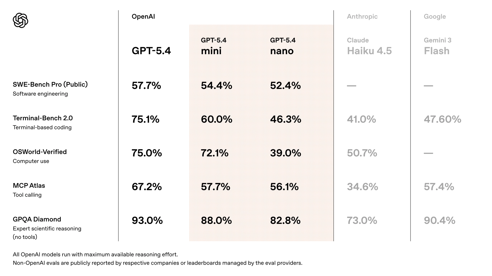
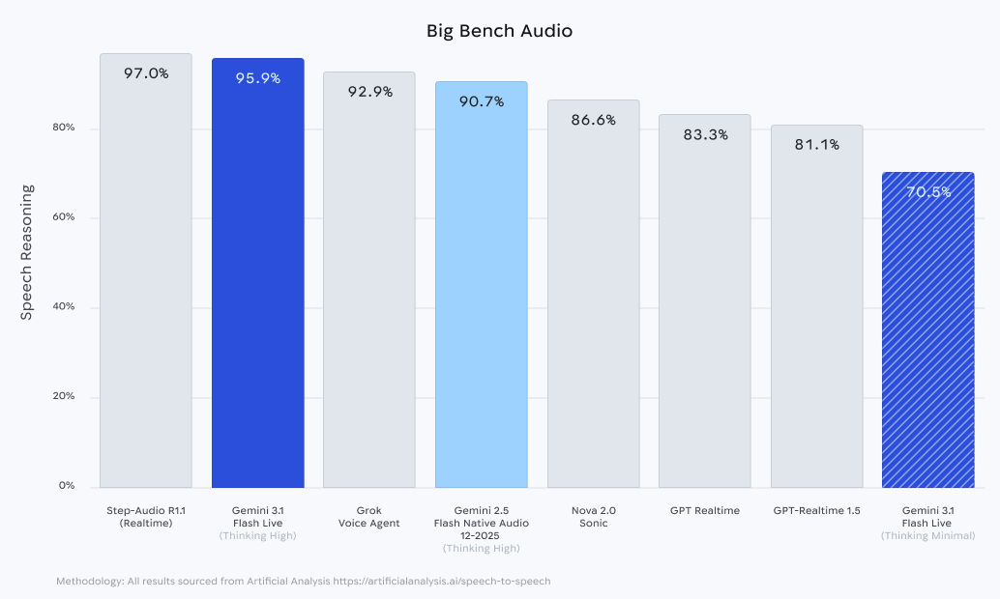
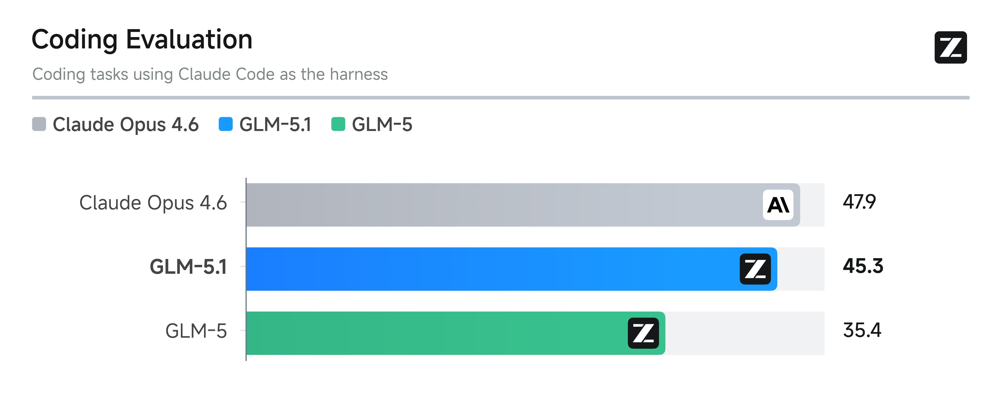
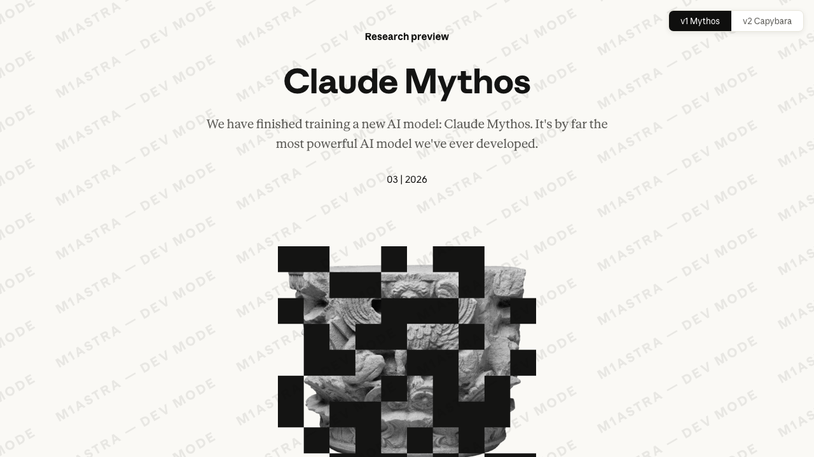
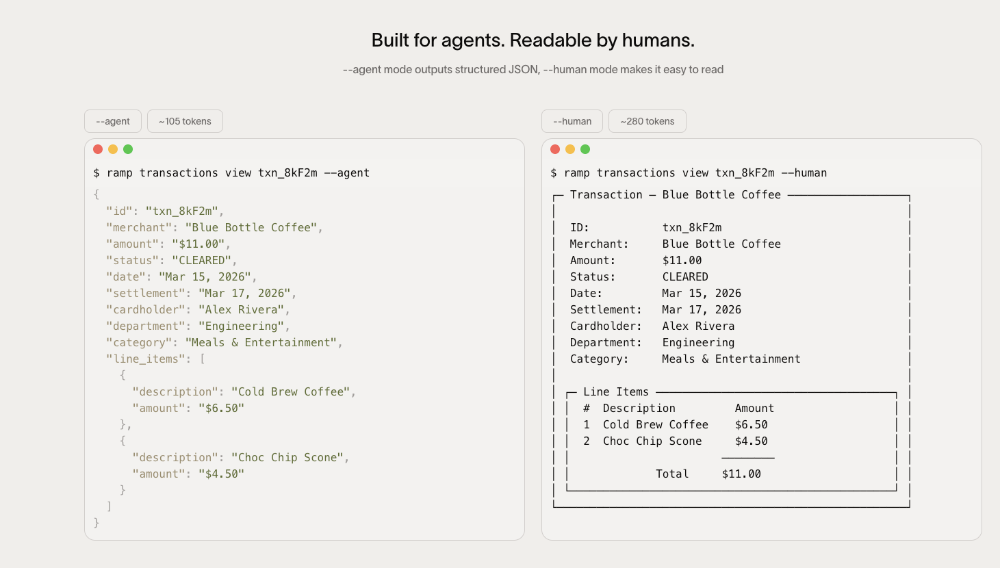
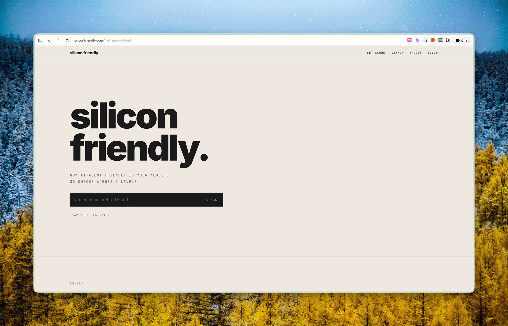
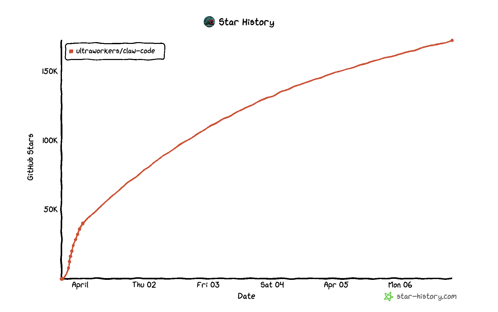
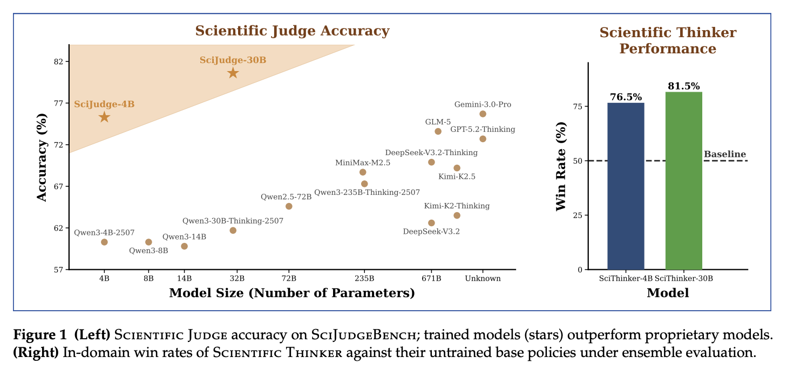
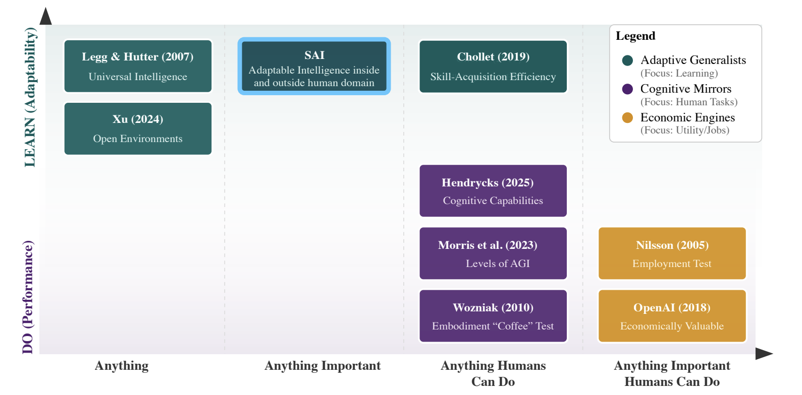
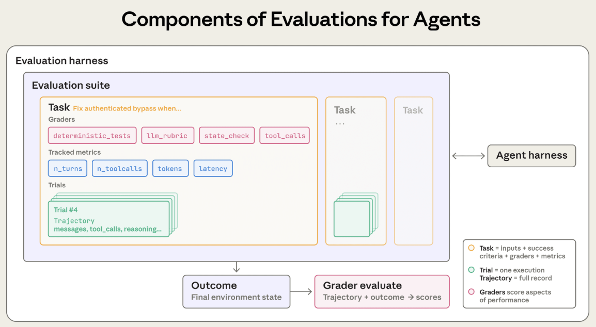

# FinTech AI Insight Weekly · Week 10 · 2026

## 1) Summary

- This week’s model updates centered on lighter execution models, real-time multimodal interaction, long-chain tasks, and tool use, including GPT-5.4 Mini / Nano, Gemini 3.1 Flash Live, GLM-5.1, and Claude Mythos.
- Featured products and projects included agent-oriented payments and finance CLI tools, Silicon Friendly, TradingAgents, and claw-code, spanning terminal interfaces, agent-readiness evaluation, multi-agent trading infrastructure, and open agent harness implementations.
- Financial developments included JPMorgan’s work on synthetic data and guardrails, Bank of America’s AI-powered meeting journey, Capital One’s multi-agent workflow case, and PNC’s working capital initiative.
- Research and commentary this week focused on long-running application harness design, AI scientific taste, specialization beyond AGI, and broader discussion around agent orchestration, engineering practice, and system design.

## 2) Model Watch

### [OpenAI Launches GPT-5.4 Mini and Nano](https://openai.com/zh-Hans-CN/index/introducing-gpt-5-4-mini-and-nano/)

OpenAI released GPT-5.4 Mini and Nano, extending GPT-5.4 capabilities into faster and cheaper small models positioned as the execution layer for sub-agents.

- `GPT-5.4 Mini` is positioned for responsive coding assistance and planner-plus-worker agent setups, while also improving computer use, reasoning, multimodal input, and tool use.
- `GPT-5.4 Nano` is aimed at simpler and more cost-sensitive tasks such as classification, extraction, ranking, and lightweight agent assistance.
- The reported performance relationship is: `GPT-5.4 > GPT-5.4 mini ≈ GPT-5.4 nano > GPT-5 mini`.
- Pricing is listed at `USD 0.75 / 4.50 per million tokens` for `GPT-5.4 mini` and `USD 0.20 / 1.25 per million tokens` for `GPT-5.4 nano`.

### [Google Releases Gemini 3.1 Flash Live Preview](https://blog.google/innovation-and-ai/technology/developers-tools/build-with-gemini-3-1-flash-live/)

Google released the Gemini 3.1 Flash Live preview, adding ultra-low-latency real-time voice and vision interaction through the Gemini Live API.

- It supports real-time voice and visual input.
- It is designed for more stable and natural multilingual conversation in noisy environments.
- It can connect directly to tools and execute actions.

### [Zhipu Releases GLM-5.1](https://x.com/Zai_org/status/2037490078126084514?s=20)

Zhipu released GLM-5.1. Public benchmark results indicate that GLM-5.1 improves meaningfully over GLM-5 on coding, while GLM-5 Turbo performs relatively well on certain long-chain tasks such as assistant-style workflows and frequent tool-calling scenarios.

### [Anthropic Is Testing Claude Mythos](https://fortune.com/2026/03/26/anthropic-says-testing-mythos-powerful-new-ai-model-after-data-leak-reveals-its-existence/?preview_id=4450088%5C)

Fortune reported that Anthropic is testing a new model called `Claude Mythos`. Leaked materials describe it as significantly more capable and more expensive, currently limited to a small set of early users, with Anthropic taking a cautious stance toward its possible cybersecurity implications.

## 3) Featured Products / Projects

### Agent-Oriented Payments and Finance CLI Tools

- [`Stripe Projects`](https://projects.dev/): consolidates infrastructure setup into the command line so developers or AI agents can provision and manage hosting, databases, auth, AI, and analytics services through a small set of CLI commands.
- [`Ramp CLI`](https://agents.ramp.com/): a CLI product for managing company finance across cards, bills, expenses, travel, approvals, and more than 50 operational tools.
- [`Visa CLI`](https://visacli.sh/): enables developers or AI agents to execute payments from the terminal. With access enabled, it can be used programmatically to pay for APIs, data services, and other metered resources.

### [Silicon Friendly: Measuring How Agent-Friendly a Website Is](https://siliconfriendly.com/)

Silicon Friendly proposes a framework for evaluating whether a website is usable by AI agents, using 30 checks across five levels.

- `L1`: basic readability, or whether an agent can read the content.
- `L2`: discoverability, or whether an agent can find the needed information.
- `L3`: structured interaction, or whether an agent can meaningfully interact with the site.
- `L4`: agent integration, or whether an agent can perform actions on the site.
- `L5`: fully autonomous operation, or whether an agent can persist and collaborate there on its own.

### [TauricResearch/TradingAgents: A Multi-Agent Financial Trading Framework](https://github.com/TauricResearch/TradingAgents)

`TradingAgents` is a multi-agent trading framework modeled after the division of labor inside a real trading firm. It combines LLM-powered fundamental, sentiment, news, and technical analysts with trader and risk roles to analyze markets, debate strategy, and produce trading decisions. The repository ranked `#13` on GitHub Trending for the month, with `16,280` stars added.

### [ultraworkers/claw-code: A Rust CLI Agent Harness](https://github.com/ultraworkers/claw-code)

`claw-code` is an open project that reimplements the Claude Code interaction model in a clean-room way. It currently includes both a Python porting workspace and a production implementation under `rust/`, covering modules such as the API client, runtime, tools, commands, plugins, and CLI, along with documentation for usage, parity, roadmap, and system philosophy.

## 4) Financial Developments

### [JPMorgan: Strengthening LLM Guardrails with Synthetic Data](https://www.jpmorganchase.com/about/technology/blog/fence-framework)

JPMorgan published a technical write-up describing how synthetic data can be used to expand the coverage and testing depth of LLM guardrails, with a focus on model governance and safety control.

### [Bank of America: Embedding AI into High-Net-Worth Client Workflows](https://newsroom.bankofamerica.com/content/newsroom/press-releases/2026/03/merrill-and-bank-of-america-private-bank-launch-ai-powered-meeti.html)

Bank of America announced an AI-powered meeting journey for Merrill and Private Bank, designed to support client meeting workflows across preparation, in-meeting collaboration, and post-meeting follow-up.

### [Capital One: Multi-Agent Workflows for Consumer Banking Operations](https://www.nvidia.com/gtc/session-catalog/sessions/gtc26-ex82362/)

At NVIDIA GTC, Capital One presented a proprietary multi-agent AI workflow case for a consumer banking operational use case, showing how multiple agents can be orchestrated around a concrete banking operations scenario.

### [PNC: Agentic AI for Working Capital Optimization](https://www.pnc.com/en/corporate-and-institutional/campaigns/optimize-working-capital-agentic-ai.html)

PNC introduced an `Optimize Working Capital Agentic AI` offering focused on working capital management, with emphasis on enterprise treasury operations, cash deployment, and related workflow efficiency.

## 5) Featured Research

### [Anthropic: Harness Design for Long-Running Application Development](https://www.anthropic.com/engineering/harness-design-long-running-apps)

Anthropic engineers showed how harness design and multi-agent structure can improve Claude’s performance on frontend design and long-running full-stack coding tasks. In frontend design, the system uses a `generator + evaluator` loop, with the evaluator operating the page through Playwright and scoring design quality across explicit dimensions. For long-horizon full-stack tasks, the setup evolves into a `planner - generator - evaluator` architecture so planning, implementation, and acceptance can iterate in multiple rounds. The article also explains how the harness was simplified as models improved from Opus 4.5 to 4.6.

### [AI Can Learn Scientific Taste](https://arxiv.org/abs/2603.14473)

This work proposes Reinforcement Learning from Community Feedback (RLCF), framing scientific taste as a problem of preference modeling and alignment. The researchers first train `Scientific Judge` on 700,000 matched pairs of high-citation and low-citation papers to evaluate the potential impact of ideas, then use it as a reward model to train `Scientific Thinker` to generate higher-potential research ideas. The paper reports that `Scientific Judge` outperforms multiple advanced models on related evaluation tasks and generalizes to future years, unseen domains, and peer-review preferences.

### [Artificial Intelligence Must Embrace Specialization Through Superhuman Adaptable Intelligence](https://arxiv.org/abs/2602.23643)

This paper argues that AGI is not a sufficiently clear or useful concept for describing the future of AI. Instead of pursuing abstract generality, the authors argue for specialization combined with superhuman performance. They introduce `Superhuman Adaptable Intelligence` (SAI) to describe systems that can both outperform humans on important tasks and fill skill gaps where human capability is limited.

## 6) Important Viewpoints

### [Andrej Karpathy: The End of Coding and the Age of Agent Loops](https://www.youtube.com/watch?v=kwSVtQ7dziU)

Karpathy discusses agent orchestration, AutoResearch, open collaboration, and model specialization. He frames effective coding as the ability to coordinate long-running, memory-bearing code agents and other autonomous systems, with the engineer’s bottleneck increasingly defined by how many tokens they can direct at what throughput.

### [Simon Willison: Engineering Practices That Make Coding Agents Actually Usable](https://www.youtube.com/watch?v=owmJyKVu5f8)

This talk summarizes Simon Willison’s view of practical coding-agent engineering, including testing, sandboxing, prompt-injection defense, and quality validation. The broader argument is that human work shifts toward test design, architectural choice, refactoring, and judgment rather than raw code production.

### [Deep Dive: Harness Engineering](https://mp.weixin.qq.com/s/-mgf8K7XZrTKoD0pMOIn3w)

The core claim of this article is simple: the model is no longer the main bottleneck, the system is. It describes the evolution from Prompt Engineering to Context Engineering and then to Harness Engineering, defining the latter as the outer-loop system that allows a model to function as a sustained agent. The write-up breaks that system into durable state, task decomposition, guides and sensors, legibility, tool mediation, and human handoff, arguing that long-horizon reliability depends more on state management, feedback loops, verification, and orchestration than on single-step model ability alone.

### [Lin Junyang: From “Reasoning” Thinking to “Agentic” Thinking](https://eu.36kr.com/zh/p/3740825962135558)

This piece looks back at the wave of “reasoning-centric” thinking triggered by models such as o1 and R1 and contrasts it with a newer “agentic” perspective. The argument is that reasoning should not merely mean generating longer thought traces; it should be tied directly to coding, tool use, long tasks, and interaction with the environment. Under that view, reinforcement learning also shifts from relatively closed reasoning RL toward more complex agentic RL, where environment design, training-serving integration, harness engineering, and outcome feedback become core competitive factors.

### [Anthropic: 81,000 Views of What People Want from AI](https://www.anthropic.com/features/81k-interviews)

Anthropic’s study collected responses from 80,508 people across 159 countries and 70 languages over one week. Respondents emphasized time savings, reduced mental burden, career advancement, and financial opportunity, while also expressing concerns about hallucinations, dependence, employment, governance, and privacy.

## 7) Weekly Observations

- The main theme this week is clear: models, products, and research are all converging around one question, which is how to move agents from demos into real working systems.
- FinTech developments are also becoming more concrete. JPMorgan is focused on governance and guardrails, while Bank of America, Capital One, and PNC are moving AI into client workflows, operational processes, and enterprise cash management.
- Across both research and commentary, the same conclusion keeps resurfacing: the ceiling for agents is set not only by the model, but by the outer-loop system around it, including harnesses, permissions, feedback, validation, and environment design.
- For FinTech teams, the more practical opportunity is still to turn permissions, workflows, payment actions, and internal collaboration into interfaces that agents can call safely, rather than simply chasing the latest model release.
