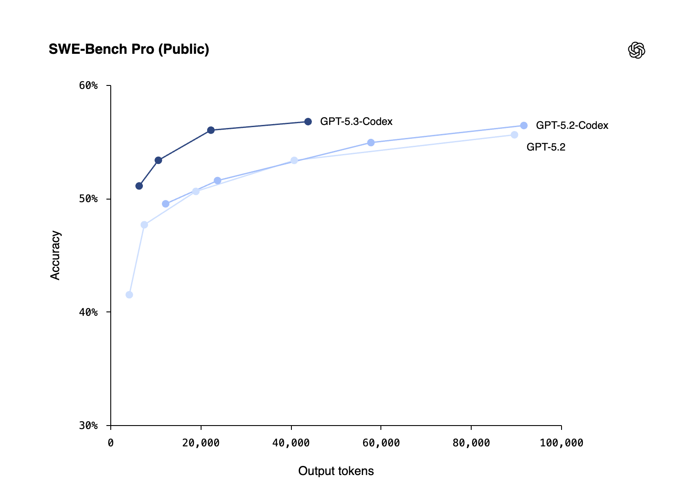
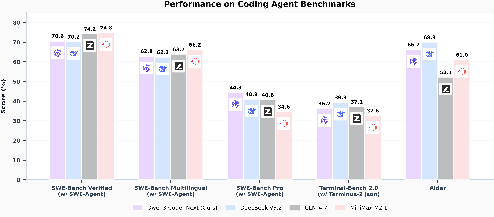
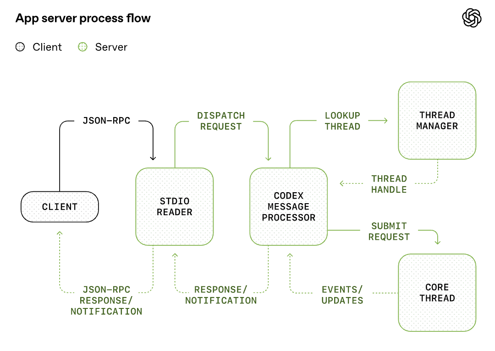
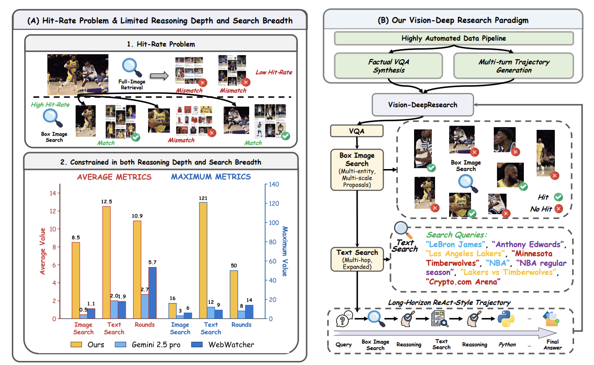

# FinTech AI Insight Weekly · Week 07 · 2026

## 1) 摘要

- OpenAI 与 Anthropic 在同一周集中更新编程模型与智能体能力，竞争重点正从“模型分数”转向“完整工程工作流交付能力”。
- 本周热门产品继续向“开发基础设施 + 多智能体协作 + 交付闭环”收敛，工具整合深度正在成为新的差异化门槛。
- 银行业近期可验证的落地场景仍集中在风险识别与流程提效，短期主流仍是“AI 辅助 + 人工复核”。
- 研究与行业观点共同提示：AI 虽能显著提速，但若缺少结构化流程与能力建设，组织长期能力可能被透支。

## 2) 模型观察

### [OpenAI 发布 GPT-5.3-Codex 编程模型](https://openai.com/zh-Hans-CN/index/introducing-gpt-5-3-codex/)

OpenAI 本周发布 GPT-5.3-Codex，产品重心进一步转向 AI 编程。该模型整合了 GPT-5.2-Codex 的代码能力与 GPT-5.2 的推理和知识能力，官方称运行速度提升约 25%。目前可在 Codex App、CLI 与 VS Code 扩展使用，API 暂未开放，目标是覆盖开发、调试、测试、部署与监控等完整软件流程。

- 面向软件全生命周期任务（编码、调试、测试、部署与运维）的一体化支持。
- 前端生成能力增强，对模糊提示可给出更完整的初始网站骨架。
- 在执行中持续反馈状态，支持人机实时交互式修正。

### [Anthropic 发布 Claude Opus 4.6 模型和 Agent Teams 更新](https://www.anthropic.com/news/claude-opus-4-6)

Anthropic 本周更新 Claude Opus 4.6，重点增强长周期代理任务能力、大型代码库稳定性，以及代码审查和调试可靠性。标准定价保持不变，同时提供约 2.5 倍更快的 `/fast` 档位（价格更高）。本次还推出仅 API 可用的 100 万上下文版本，并在 Claude Code 中上线 Agent Teams 并行协作机制，整体面向企业级复杂研发与评审场景。

- 更强的长时任务执行与自检纠错能力，提升复杂工程任务连续性。
- 100 万上下文版本（API）支持超长文档与大规模代码上下文处理。
- Agent Teams 支持“队长 + 多实例并行”协作，适配多模块并行开发与评审。

### [Mistral AI 发布 Voxtral Transcribe 2 语音转文本系列模型](https://mistral.ai/news/voxtral-transcribe-2)
Mistral AI 在同周发布 Voxtral Transcribe 2 系列，分别覆盖批量转录（Mini Transcribe V2）和实时转录（Realtime）两类场景。该更新的价值在于把“高精度转录 + 低延迟实时能力”分层提供，便于企业按成本和时延要求做模型选型。

### [千问开源 Qwen3-Coder-Next 编码模型](https://huggingface.co/Qwen/Qwen3-Coder-Next)
阿里千问发布并开源 Qwen3-Coder-Next，定位编程智能体与本地开发场景，采用 3B 激活参数（总参数量 80B）的架构。其官方强调长程推理、复杂工具调用和失败恢复能力，对本地可控的工程自动化实践更友好。

## 3) 热门产品

### [CreateOS：内置大量开发基建的 AI 开发平台](https://createos.nodeops.network/)
CreateOS（NodeOps）把对话式开发、代码编辑、CI/CD 和部署放进一个界面，思路是“少折腾环境，多交付功能”。它更适合需要快速验证想法的开发者和创作者，能明显减少 DevOps 配置和工具切换的时间消耗。对银行内部团队来说，这类一体化平台的意义在于更快把原型推到可评审、可上线的版本。

### [GitButler：颜值很高的 git 客户端](https://gitbutler.com/)
GitButler 抓住的是 AI 编码时代最容易混乱的一环：分支和提交管理。它把并行分支、分支栈和回滚操作做得更直观，适合开发团队和工程管理者日常协作。价值不在“更炫”，而在于减少合并冲突和返工成本。

### [Inspector：又一个基于 Claude Code 的设计产品](https://www.tryinspector.com/)
Inspector 把“改界面”这件事做得更直接：在浏览器里选中元素，就能定位并修改本地代码。它连接设计与前端开发流程，改完即可进入分支和 PR，适合设计师与前端协同迭代。对内部产品团队来说，这能明显压缩 UI 调整的沟通往返。

### [Auto-Claude：自主多智能体编程框架](https://github.com/AndyMik90/Auto-Claude)
Auto-Claude 是社区维护的多智能体编程框架，基于 Claude Code CLI。它擅长把复杂任务拆成并行工作项，再通过隔离 worktree、看板和自动合并流程收敛结果。对于持续交付压力较大的工程团队，这种“任务编排 + 自动化验证”模式更实用。

### [Aqua Voice：实时语音输入工具](https://aquavoice.com/)
Aqua Voice 用语音替代大量重复输入，支持跨应用、多语言和实时润色。它面向知识工作者、开发者和内容团队，尤其适合长文本录入和快速改写。放到银行场景，会议纪要、文档草拟和客服辅助这几类场景会最先体现收益。

## 4) 金融动态

### [ANZ：上线 Agentic AI CRM 以改造企业银行流程](https://news.google.com/rss/articles/CBMiugFBVV95cUxQZHNBZ3BaUGxFUGlyUlNuUVZfYjVPYV9xTG11U1IxYUlWMEMxLVFBLWl2Q3JDQXJjSXVQWFNTc1FHRTBMRUdXeGtxLXV3ZDVlVXlfREFCdGpQZUxFV1B0VFI0Rm1SbFE4bDM4ajdyaEYwZ284WDBBODZVc2o4UDJYZEZwbjR0QVFwcHRhZ2h1bThBY0RUUDlxLTU1dG41dlI2TURlMzJ1N0c1RTgzSHZ0N2RwM2xJWnhGWGc?oc=5)
ANZ 披露其在企业银行条线推进 agentic AI 驱动的 CRM，重点是让客户经理在业务流程中更快调用客户上下文与建议动作。这个信号说明银行正把生成式 AI 从“问答助手”推进到“流程节点执行”，直接指向一线业务效率提升。

### [CommBank：用 AI 识别“1 cent”家庭暴力相关交易模式](https://news.google.com/rss/articles/CBMipAFBVV95cUxNcXpzbllxeXE0amRELVJqM2VOVG5rX2NHT2VpMEtOdU5DejVsbkFPRWh3cjl4OWZ4ZXBtU1hJMXltUG1kYVZ2blFuSUxaMnA3bWNPcU5WS20tU2tyM19yMHkwNjhuRjBILVZTdTRsenpUdzBwOVNkcXlGdzYxRjlDVDRuazRfdEltVllCaUJPb3dIYzdaTFlrNVBlX0otU2ZVWkpJMA?oc=5)
CommBank 公布其利用 AI 识别与家庭暴力相关的“1 cent transfer”可疑行为模式，以强化预警与干预能力。该案例表明，AI 在银行高优先级落地仍以风险识别和社会责任场景为主，并强调与人工处置流程的衔接。

### [Standard Chartered：发布“AI 下一波浪潮”观察](https://news.google.com/rss/articles/CBMigAFBVV95cUxQS3ViRjFBZS1NUGdaelZWVzc3aGJjWEVfX1B0RHRrYi1iYlo0UW1JLW15czhkRkgzTmZqOVNyVzFBNUlMTjhQcHNEdkZPVjV0WWFzY2c3UzZBNi05QzdMTnNldmd6V0R3cTNoUlhwdVl5cmwyVDllZGFCelcyUDlOMw?oc=5)
Standard Chartered 推出“AI泡沫指数”，以-3至+3衡量市场信心，帮助投资者理解AI投资变化。该指数由2026年1月的2升至2月的2.5，显示风险回报改善。整体来看，AI仍具结构性增长机会，但仍需关注估值、竞争与监管等风险。

## 5) 热门研究

### [人工智能如何影响个人技能形成](https://arxiv.org/abs/2601.20245)
随机实验显示，AI 辅助虽可在部分任务带来效率，但会显著削弱新手在概念理解、代码阅读与调试上的能力形成；研究通过比较“有/无 AI 辅助”学习新异步编程库，并识别 6 类 AI 交互模式，发现仅部分高认知参与模式能兼顾学习效果。

### [SkillRL：Evolving Agents via Recursive Skill-Augmented Reinforcement Learning](https://www.alphaxiv.org/abs/2602.08234)
SkillRL 通过递归技能增强强化学习提升了智能体在复杂任务中的泛化与成功率，展示了“技能化”训练路径的有效性；其在 ALFWorld 取得 89.9% 成功率、在 WebShop 取得 72.7%，并在搜索增强问答任务上优于多种记忆增强与更大闭源基线。

### [解锁 Codex Harness：统一智能体 App Server 协议与运行框架](https://openai.com/zh-Hans-CN/index/unlocking-the-codex-harness/)
OpenAI 将 Codex 智能体能力封装为基于 JSON-RPC 的 App Server，让 CLI、IDE 与桌面端复用同一运行时与会话原语，提升多端一致性与可维护性；该架构通过流式事件和标准握手机制支持更细粒度、可恢复的 agent 执行过程。

### [Vision-DeepResearch：激发多模态大语言模型深度研究能力](https://arxiv.org/abs/2601.22060)
Vision-DeepResearch 提出多轮、多实体、多尺度的视觉与文本联合检索范式，在高噪声现实场景下提升复杂问题求解稳定性；其通过冷启动监督与强化学习内化深度研究能力，并在多模态深度研究任务上显著优于既有工作流。

## 6) 重要观点

### [互联网已死，Agent 永生](https://mp.weixin.qq.com/s/cX3bYrI9Sq7sOJj0E6V9IQ?scene=0&subscene=90)
文章提出 AI 时代的软件主体正在从“人类用户”转向“AI Agent”，传统以 DAU 和流量为核心的产品逻辑将被重构。对应到商业层面，算力与 Token 的获取和调度能力正在成为新的竞争关键。

### [代码不贵，给我看看它的实现方式](https://nadh.in/blog/code-is-cheap/)
作者认为在 LLM 普及后，代码产出本身不再稀缺，真正稀缺的是问题定义、架构判断和结果责任。软件工程的重心正在从“高强度编码”迁移到“高质量思考与表达”。

### [软件工程的 K 型未来](https://x.com/ian_dot_so/status/2013316676637294890?s=20)
该观点将工程师分化为两类：一类能围绕业务目标和模糊问题构建高杠杆系统，另一类停留在流程与工具层。AI 加速不会平均提升所有人，反而会放大工程判断力与跨职能协作能力差异。

## 7) 本周观察

- 从本周模型发布节奏看，金融科技团队的关键能力已不只是“选哪家模型”，而是能否把模型稳定嵌入研发和运营流程，并形成可审计的交付链路。
- 银行业最新可验证案例（ANZ、CommBank）再次说明，短期 ROI 更清晰的方向仍是“流程提效 + 风险识别”，而不是高风险全自动决策，这与强监管环境的落地逻辑一致。
- 产品层面正快速出现“多智能体并行 + 工程基础设施整合”的工具形态，建议先在低风险研发场景验证，再逐步扩展到运营和前台流程。
- 结合本周研究与行业观点，团队建设需要同步推进“效率提升”和“能力保全”：既要用 AI 提速，也要避免把关键判断能力外包给模型。

