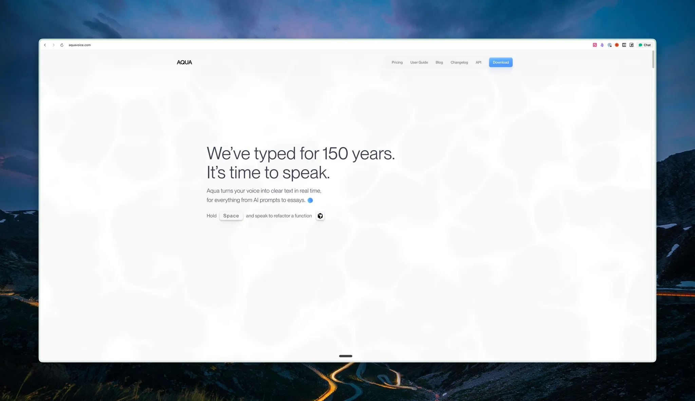
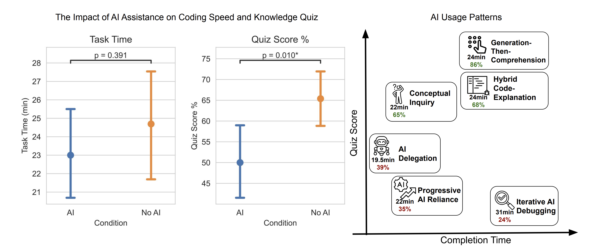
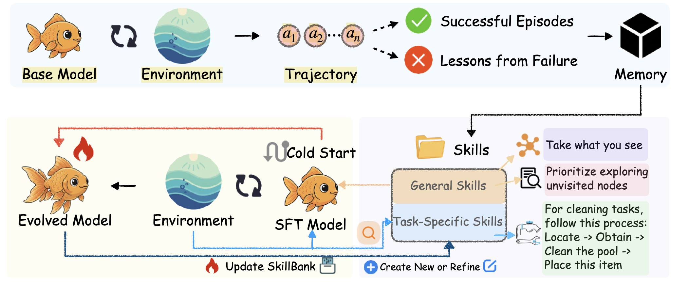
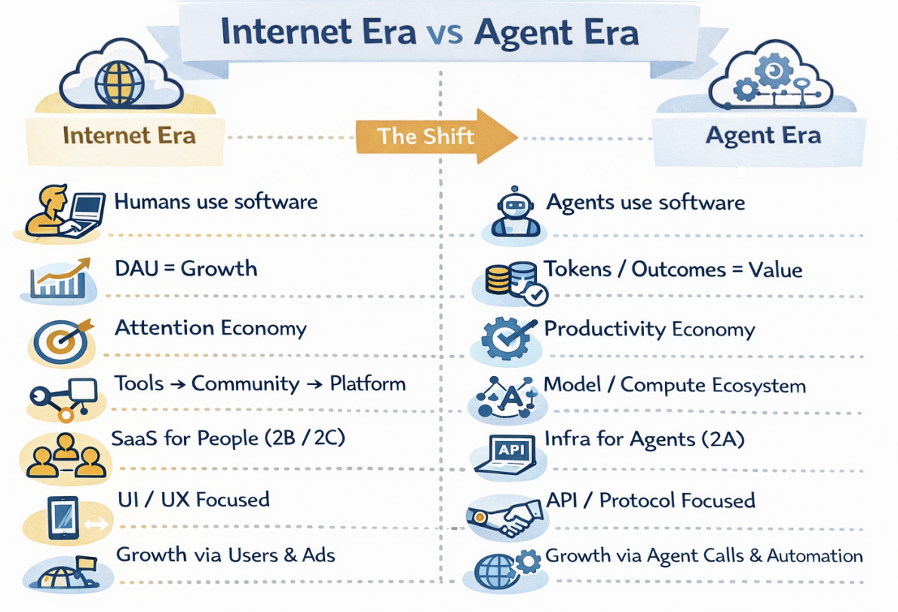
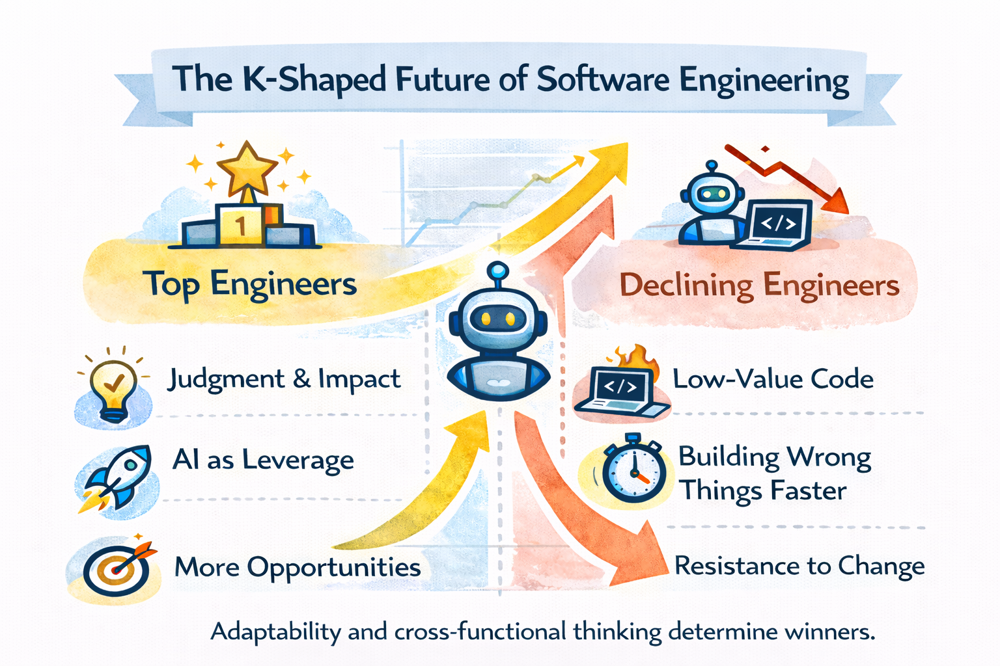

# FinTech AI Insight Weekly · Week 07 · 2026

## 1) Summary

- OpenAI and Anthropic both released major coding-model and agent updates in the same week, and the focus is moving from benchmark scores to end-to-end engineering workflow delivery.
- This week’s popular products continue to converge on “development infrastructure + multi-agent collaboration + delivery loop closure,” and integration depth is becoming a new moat.
- In banking, near-term validated use cases remain concentrated in risk detection and process efficiency, with “AI assistance + human review” still the dominant operating pattern.
- Research and industry commentary point to the same conclusion: AI can accelerate output, but without structured workflows and capability building, long-term organizational competence may be weakened.

## 2) Model Watch

### [OpenAI Released the GPT-5.3-Codex Coding Model](https://openai.com/zh-Hans-CN/index/introducing-gpt-5-3-codex/)

OpenAI launched GPT-5.3-Codex this week, with a clearer product focus on AI coding. The model combines GPT-5.2-Codex coding capability with GPT-5.2 reasoning and knowledge capability, and OpenAI states it runs about 25% faster. It is currently available in Codex App, CLI, and the VS Code extension. API access is not yet available, and the target scope covers the full software lifecycle from development to debugging, testing, deployment, and monitoring.

- Unified support across software lifecycle tasks, including coding, debugging, testing, deployment, and operations.
- Stronger frontend generation that can produce a more complete initial site scaffold from ambiguous prompts.
- Continuous in-run status feedback that enables real-time human-in-the-loop correction.

### [Anthropic Released Claude Opus 4.6 and Agent Teams Updates](https://www.anthropic.com/news/claude-opus-4-6)

Anthropic updated Claude Opus 4.6 this week, with emphasis on long-horizon agent tasks, large-codebase stability, and reliability in code review and debugging. Standard pricing remains unchanged, while a roughly 2.5x faster `/fast` tier is available at a higher price. Anthropic also introduced a 1M-context version available via API only, and launched Agent Teams parallel collaboration in Claude Code, targeting complex enterprise R&D and review workflows.

- Stronger long-running task execution and self-correction for better continuity in complex engineering work.
- 1M-context API version for long-document and large-scale code-context processing.
- Agent Teams supports “captain + parallel instances” collaboration for multi-module development and review.

### [Mistral AI Released the Voxtral Transcribe 2 Speech-to-Text Family](https://mistral.ai/news/voxtral-transcribe-2)
Mistral AI released the Voxtral Transcribe 2 family in the same week, covering both batch transcription (Mini Transcribe V2) and real-time transcription (Realtime). The key value is a clear split between high-accuracy transcription and low-latency real-time capability, giving enterprises more flexibility to choose based on cost and latency requirements.

### [Qwen Open-Sourced the Qwen3-Coder-Next Coding Model](https://huggingface.co/Qwen/Qwen3-Coder-Next)
Alibaba Qwen released and open-sourced Qwen3-Coder-Next, targeting coding-agent and local development scenarios. It uses an architecture with 3B active parameters (80B total parameters). Official messaging emphasizes long-horizon reasoning, complex tool use, and failure recovery, making it well aligned with controllable local engineering automation.

## 3) Trending Products

### [CreateOS: An AI Development Platform with Built-In Engineering Infrastructure](https://createos.nodeops.network/)
CreateOS (NodeOps) puts conversational development, code editing, CI/CD, and deployment into one interface. The design philosophy is simple: spend less time on setup, ship more features. It fits developers and creators who need rapid validation, and for bank internal teams it can shorten the path from prototype to review-ready and release-ready builds.

### [GitButler: A High-UX Git Client](https://gitbutler.com/)
GitButler targets one of the most chaotic areas in AI-era development: branch and commit management. It makes parallel branches, branch stacks, and rollback operations much more intuitive for day-to-day engineering collaboration. The core value is not novelty but reduced merge conflicts and less rework.

### [Inspector: A Claude Code-Based Design Product](https://www.tryinspector.com/)
Inspector makes UI changes far more direct: select an element in the browser, locate and edit local code, then move into branch and PR workflow. It connects design and frontend execution in one flow, which is useful for fast iteration between designers and engineers. For internal product teams, this can cut UI communication loops materially.

### [Auto-Claude: An Autonomous Multi-Agent Coding Framework](https://github.com/AndyMik90/Auto-Claude)
Auto-Claude is a community-maintained multi-agent coding framework built on Claude Code CLI. It is good at decomposing complex work into parallel tasks, then converging outcomes through isolated worktrees, kanban flow, and automated merge processes. For teams under continuous delivery pressure, this “task orchestration + automated validation” model is practical.

### [Aqua Voice: A Real-Time Voice Input Tool](https://aquavoice.com/)
Aqua Voice replaces repetitive typing with voice input, with cross-app support, multilingual capability, and real-time polishing. It targets knowledge workers, developers, and content teams, especially in long-form drafting and fast rewriting. In banking, the earliest gains are likely in meeting notes, document drafting, and customer-service support.

## 4) Banking Dynamics

### [ANZ: Launching Agentic AI CRM to Reshape Corporate Banking Processes](https://news.google.com/rss/articles/CBMiugFBVV95cUxQZHNBZ3BaUGxFUGlyUlNuUVZfYjVPYV9xTG11U1IxYUlWMEMxLVFBLWl2Q3JDQXJjSXVQWFNTc1FHRTBMRUdXeGtxLXV3ZDVlVXlfREFCdGpQZUxFV1B0VFI0Rm1SbFE4bDM4ajdyaEYwZ284WDBBODZVc2o4UDJYZEZwbjR0QVFwcHRhZ2h1bThBY0RUUDlxLTU1dG41dlI2TURlMzJ1N0c1RTgzSHZ0N2RwM2xJWnhGWGc?oc=5)
ANZ disclosed an agentic AI-driven CRM initiative in corporate banking, focused on helping relationship managers call customer context and next-best actions more quickly inside live workflows. The signal is clear: banks are moving generative AI from “Q&A assistant” into execution at workflow nodes, directly tied to frontline productivity.

### [CommBank: Using AI to Detect “1 Cent” Domestic-Abuse-Related Transaction Patterns](https://news.google.com/rss/articles/CBMipAFBVV95cUxNcXpzbllxeXE0amRELVJqM2VOVG5rX2NHT2VpMEtOdU5DejVsbkFPRWh3cjl4OWZ4ZXBtU1hJMXltUG1kYVZ2blFuSUxaMnA3bWNPcU5WS20tU2tyM19yMHkwNjhuRjBILVZTdTRsenpUdzBwOVNkcXlGdzYxRjlDVDRuazRfdEltVllCaUJPb3dIYzdaTFlrNVBlX0otU2ZVWkpJMA?oc=5)
CommBank reported using AI to identify suspicious “1 cent transfer” patterns associated with domestic abuse, strengthening early warning and intervention capability. This case shows that high-priority banking deployment still centers on risk identification and social-responsibility scenarios, with strong coupling to human handling processes.

### [Standard Chartered: Publishing Its “Next Wave of AI” View](https://news.google.com/rss/articles/CBMigAFBVV95cUxQS3ViRjFBZS1NUGdaelZWVzc3aGJjWEVfX1B0RHRrYi1iYlo0UW1JLW15czhkRkgzTmZqOVNyVzFBNUlMTjhQcHNEdkZPVjV0WWFzY2c3UzZBNi05QzdMTnNldmd6V0R3cTNoUlhwdVl5cmwyVDllZGFCelcyUDlOMw?oc=5)
Standard Chartered introduced an “AI Bubble Index,” scoring market sentiment on a -3 to +3 range to help investors interpret shifts in AI investment trends. The index rose from 2.0 in January 2026 to 2.5 in February, suggesting improved risk-return conditions. The broader message is structural growth remains, but valuation, competition, and regulation risks still matter.

## 5) Research Highlights

### [How AI Affects Individual Skill Formation](https://arxiv.org/abs/2601.20245)
A randomized experiment shows AI assistance can improve efficiency in some tasks but significantly weakens skill formation in conceptual understanding, code reading, and debugging for novices. By comparing learning outcomes with and without AI while studying a new asynchronous programming library, the paper identifies six AI interaction patterns and finds only a subset of high-cognitive-engagement patterns preserve learning quality.

### [SkillRL: Evolving Agents via Recursive Skill-Augmented Reinforcement Learning](https://www.alphaxiv.org/abs/2602.08234)
SkillRL improves agent generalization and success rates in complex tasks through recursive skill-augmented reinforcement learning, demonstrating the value of a skill-centric training path. Reported results include 89.9% success on ALFWorld, 72.7% on WebShop, and stronger performance than multiple memory-augmented and larger proprietary baselines in retrieval-augmented QA.

### [Unlocking the Codex Harness: A Unified Agent App Server Protocol and Runtime](https://openai.com/zh-Hans-CN/index/unlocking-the-codex-harness/)
OpenAI packages Codex agent capability into a JSON-RPC-based App Server so CLI, IDE, and desktop clients can share the same runtime and session primitives, improving cross-platform consistency and maintainability. The architecture also supports finer-grained and recoverable agent execution via streamed events and standardized handshake mechanisms.

### [Vision-DeepResearch: Enabling Deep Research Capability in Multimodal LLMs](https://arxiv.org/abs/2601.22060)
Vision-DeepResearch proposes a joint visual-text retrieval paradigm across multiple rounds, entities, and scales, improving robustness on complex problem solving under noisy real-world conditions. Through cold-start supervision and reinforcement learning, it internalizes deep-research behavior and reports clear gains over prior multimodal deep-research workflows.

## 6) Key Viewpoints

### [The Internet Is Dead, Long Live Agents](https://mp.weixin.qq.com/s/cX3bYrI9Sq7sOJj0E6V9IQ?scene=0&subscene=90)
The article argues that the primary software actor is shifting from human users to AI agents, and product logic centered on DAU and traffic will be fundamentally restructured. At the business level, access to and orchestration of compute and tokens is becoming a core competitive lever.

### [Code Is Cheap, Show Me How It Is Implemented](https://nadh.in/blog/code-is-cheap/)
The author argues that in the LLM era, code output itself is no longer scarce; what remains scarce is problem definition, architectural judgment, and accountability for outcomes. Software engineering is shifting from high-intensity coding toward high-quality thinking and expression.

### [The K-Shaped Future of Software Engineering](https://x.com/ian_dot_so/status/2013316676637294890?s=20)
This viewpoint splits engineers into two groups: those who can build high-leverage systems around business goals and ambiguous problems, and those who remain at the process-and-tools layer. AI acceleration will not uplift everyone equally; it amplifies differences in engineering judgment and cross-functional collaboration.

## 7) Weekly Observations

- Based on this week’s model release cadence, the key capability for fintech teams is no longer just model choice, but whether models can be embedded stably into R&D and operations with an auditable delivery chain.
- Recent verifiable banking cases (ANZ, CommBank) again show that short-term ROI is clearest in process efficiency and risk detection, not in high-risk fully autonomous decisions. This aligns with implementation logic in heavily regulated environments.
- Product patterns are rapidly moving toward “multi-agent parallelism + integrated engineering infrastructure.” A practical path is to validate first in low-risk R&D scenarios, then expand into operations and frontline workflows.
- Taken together, this week’s research and viewpoints suggest team design must advance both “efficiency gains” and “capability preservation”: use AI to move faster, but avoid outsourcing core judgment to models.
