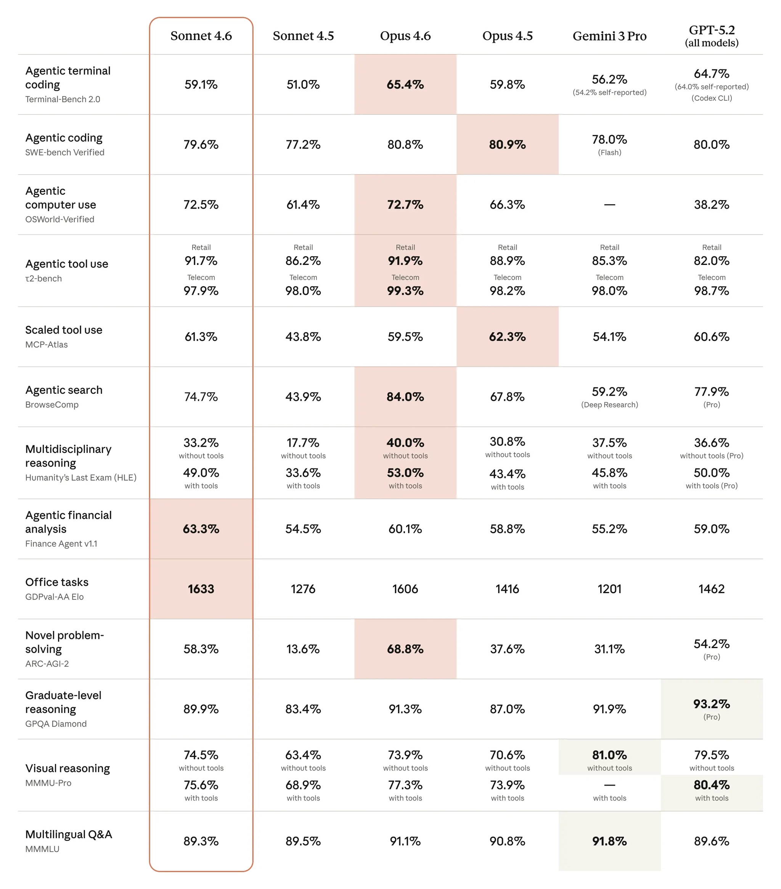
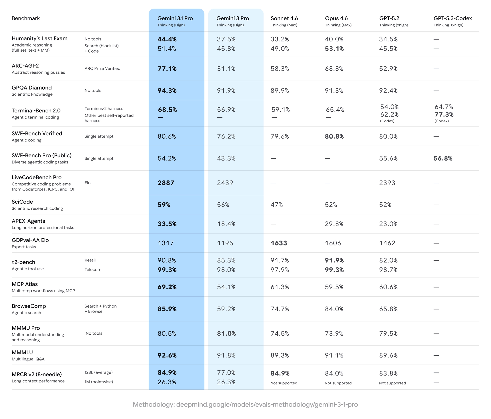

# FinTech AI Insight Weekly · Week 08 · 2026

## 1) 摘要

- 本周模型动态已经明显分成两条线：海外厂商继续强化编程、推理和知识工作能力，国内厂商则把重心放到多模态理解、国产算力适配和 Agent 工程能力上。
- 产品侧最值得关注的，不是又多了几个聊天入口，而是 Claude、WebMCP、Entire、EvoMap 这类能力开始直接进入企业工作流、浏览器交互、团队协作和经验沉淀层。
- 银行动态显示，大型机构正在把 AI 从概念验证推进到更具体的基础设施、反欺诈、组织协同和数据平台建设场景，落地方向比前几个月更清晰。
- 研究与观点部分共同指向一个更现实的判断：下一阶段竞争不只看模型分数，而是看智能体是否安全、可追溯、能持续协作，并真正接入复杂业务流程。

## 2) 模型观察

### [Anthropic 发布 Claude Sonnet 4.6 模型](https://www.anthropic.com/news/claude-sonnet-4-6)

Anthropic 在 Opus 4.6 之后继续更新 Sonnet 4.6，定价保持在每百万 token 输入 3 美元、输出 15 美元。发布信息显示，它在编程、长文本推理、知识工作与办公任务上的整体能力继续上升，同时更强调“给轻量 AI 用户直接用起来”。另外，Sonnet 4.6 也提供了 100 万上下文版本，但目前仅通过 API 提供。

- 在编程与知识工作任务上继续强化，目标是降低轻度用户的使用门槛。
- 提供 100 万上下文版本（API），支持更长文档和更复杂任务链路。
- 配套工具能力继续增强，网页搜索与工具调用场景下的结果处理更自动化。

### [谷歌发布 Gemini 3.1 Pro 模型](https://blog.google/innovation-and-ai/models-and-research/gemini-models/gemini-3-1-pro/)

谷歌本周发布 Gemini 3.1 Pro，可视作对 3.0 Pro 的一次关键修复与增强。官方披露其在 ARC-AGI-2 的经验证得分为 77.1%，相比 3 Pro 有明显提升。它在视觉编程和创意网页类任务上的表现更突出，但在长任务连续执行和复杂工具调用上仍有改进空间。

- 在 ARC-AGI-2 等推理评测上提升明显，重点补强复杂逻辑模式识别。
- 视觉编程能力增强，适合 SVG、3D 草图到页面等高视觉密度任务。
- 已进入 AI Studio、Vertex AI、NotebookLM 等生态，企业接入路径更清晰。

### [字节发布 Seedance 2.0 模型](https://www.theinformation.com/briefings/bytedance-launches-new-llm-better-visual-understanding)
从仓库现有模型追踪材料看，字节本轮更新的重点是 Doubao Seed 2.0。这一代模型更强调视觉理解与多模态能力提升，目标不是单纯做聊天增强，而是继续把豆包体系往更完整的通用模型平台推进。对企业团队而言，这类模型的意义在于，把视觉理解、内容生成和后续智能体调用放到同一套底座上，减少多模型拼接带来的复杂度。

- 模型重点转向“更强视觉理解”，适合图文混合输入和多模态任务。
- 延续字节在豆包体系上的产品化路线，强调面向更广泛业务场景的统一能力底座。
- 对金融科技团队的参考价值在于，可用于文档理解、界面识别、营销内容生成等复合工作流。

### [智谱发布 GLM-5 模型](https://www.msn.cn/zh-cn/money/%E9%80%9A%E7%94%A8/%E6%99%BA%E8%B0%B1%E5%8F%91%E5%B8%83glm-5%E6%A8%A1%E5%9E%8B-%E5%9B%9B%E5%A4%A7%E5%88%9B%E6%96%B0%E7%AA%81%E7%A0%B4-%E5%85%A8%E9%9D%A2%E9%80%82%E9%85%8D%E5%9B%BD%E4%BA%A7%E7%AE%97%E5%8A%9B%E7%94%9F%E6%80%81/ar-AA1WTURj)
GLM-5 是智谱这一轮最值得关注的基础模型更新。仓库里的模型状态与论文材料都提到，它的重点不只是常规问答能力，而是把推理、编码和智能体工程能力一起抬上去，试图从“能聊天”走向“能做复杂任务”。如果把它放在国内模型竞争格局里看，GLM-5 更像是在争夺企业级 Agent 与工程场景的心智位置。

- 在推理、编码和智能体任务上同步强化，目标是支撑更复杂的工程工作流。
- 已围绕国产算力适配展开布局，便于在本地化和合规约束更强的环境中落地。
- 从现有论文摘要看，GLM-5 也在推动“从 vibe coding 到 agentic engineering”的能力跃迁。

## 3) 热门产品

### [Anthropic：把 Claude 从代码助手推向企业级工作流代理](https://www.anthropic.com/news/claude-code-security)
Anthropic 这一轮产品动作可以放在一起看：它不再只把 Claude 包装成“更聪明的聊天工具”或“写代码更快的助手”，而是在持续往企业工作流深处推进。其能力覆盖了代码安全审计、跨系统插件与连接器，以及遗留系统现代化改造，目标是让 Claude 从单点提效工具升级为可接入真实业务流程的工作代理。

在研发侧，Claude Code Security 不再停留在规则匹配式扫描，而是尝试通过阅读代码上下文和组件交互关系来发现更复杂的逻辑漏洞，并把高风险问题尽量前移到开发阶段。对于合规要求更高的金融机构，这类能力的价值在于，安全审计开始更接近真实工程语境，而不只是静态规则告警。

在企业办公与专业软件侧，Anthropic 又通过 Cowork 插件、连接器和统一管理界面，把 Claude 接入 Google Workspace、微软 Office 以及 FactSet、MSCI、LSEG、S&P Global 等平台。它解决的不是“再加一个聊天入口”，而是把研究、投行、财富管理和运营文档这些跨系统流程逐步交给 AI 协调执行。

更值得银行业关注的是，Claude Code 也开始把能力延伸到 COBOL 等遗留系统现代化场景。它主打依赖关系梳理、文档补全、风险识别和改造前分析，把原本需要顾问团队长周期完成的探索阶段大幅压缩。对仍背负大量核心旧系统的金融机构来说，这类产品形态比单纯的代码补全更接近真实需求。

### [EvoMap：让 Agent 共享经验共同进化](https://evomap.ai/)
EvoMap 试图解决 AI Agent 生态里三个长期问题：重复计算、经验孤岛和平台锁定。它的核心做法是把已验证的策略、修复方案和工作流封装成可追溯的资产，在开放网络里分发、验证、继承和组合，让后来的 Agent 不必每次从零开始重试一遍。对企业团队来说，这类产品的意义不只是“节省 token”，更在于把成功经验沉淀成可复用、可交易、可扩散的能力层，减少单一平台或单一模型锁死工作流的风险。

### [Entire：基于 Git 把代码改动与 Agent 会话绑在一起](https://docs.entire.io/introduction)
Entire 关注的不是“Agent 能不能写代码”，而是“团队以后怎么理解、追溯和继续接手这些代码”。它通过 Git hooks 在开发流程里自动捕获 AI 编码会话，把提交、提示词、对话记录、工具调用和文件改动一起变成可检索的 checkpoint，让团队回看任意一次 commit 时都能知道当时为什么这么做。对协作型研发组织来说，这很关键，因为 AI 时代真正稀缺的往往不是生成代码本身，而是把决策过程、上下文和历史权衡稳定保留下来。

### [Chrome WebMCP：让 Agent 直接与网页服务逻辑交互](https://developer.chrome.com/blog/webmcp-epp?hl=zh-cn)
WebMCP 的关键变化在于，它不再要求 Agent 像人类一样盯着页面、截屏、找按钮，而是允许网页向浏览器内的智能体暴露结构化工具与状态接口。对产品团队来说，这意味着网页交互可以从“视觉模拟点击”转向“逻辑直连调用”，从而减少脆弱的 DOM 依赖、降低 token 消耗，并提升自动化流程的稳定性。对金融科技场景而言，这类能力尤其适合表单填写、查询筛选、客户支持和流程办理等高频 Web 任务。

## 4) 金融动态

### [Citigroup：组建 AI 基础设施投行团队](https://news.google.com/rss/articles/CBMisgFBVV95cUxNclMtSUY4WWZlUkdpUGUxZkMxTTAyaDdBS2QyeHNSemdXZkxiZmFVaUF1bnhoSDdKcTZITm1WR2kxNS0waEhaZVdqemJhUDZvaWVsRmY1VWVEakhqaXAwNmsycy0xWE1pX1RMRnBfVHZVNkJGU3ZqUU1jR19TcXpSRlVQOHRvUU0yX0JqdXFPbXY5Y2Yycy0zSm1ac3dsbDhiOFR3ZDNmbkFlX0lrMXlzQTVB?oc=5)
花旗开始搭建聚焦 AI 基础设施的投行业务团队，信号很明确：AI 正从技术主题转为资本与产业并行推进的长期主线。对金融科技团队而言，这会进一步提升“AI 相关资产、算力与平台能力”在投融资和战略规划中的权重。

### [JPMorgan：AI 正在重塑组织分工与岗位流动](https://news.google.com/rss/articles/CBMilwFBVV95cUxQb0RMSnJUMWdRMmFqa0RuRzFoUUFKb05iQm5felowaUVac0lNMkIyaTd5NWpxZzhqMHFJb3ZyRHhDal9nY3M3ZU1LQ1pwQmVHRDZRT0JTdkZEMm1LQXJVdWFzeWdNTUlpejloSFQxbDJLZ3l5T0NMZDJCZjg4RE5heG5MX0RySHMwRUNwc01TWXZYUlB4TW8w0gGcAUFVX3lxTFBhcTMxNnZ6d0JBSUJlZGpIQ0k2WEFHUEZvUHlYNEtZYVV4RXNPMTc3M1hkQWt1a0dnaHJZaWQyay1GWkx1bV9TVTlaUk9NWVR2RHJaaFRUOEMyYkRaV3g3MWtwdzZILUcwc1Z3c0VqZkIzY3lCcWhXQldCd1pvVkx3dzJ0Z0ZfX1dzVWlyamNFMWQ5Ri1RSFpyZnpiSQ?oc=5)
摩根大通管理层公开讨论 AI 带来的岗位再部署，反映出大型银行已从“工具试用”转向“组织运营重构”。这意味着下一阶段竞争不只看模型接入速度，更看组织能否把人机协作流程稳定跑起来。

### [TD Bank：将 AI 风险防护前置到反欺诈教育与运营流程](https://news.google.com/rss/articles/CBMiqwFBVV95cUxNM2NfbTVWdWZMQ0hON3JvX01yU2xOaUJxZWo0ZUs5ajRpWURMc1c1VVhGUzZxaGdlbWJLeFlfLURRTVY3OTRSdmtoeG9iZnp0OWN5Q1hoUnUtMExHM1pPMjBqQUtNQzFhZk9mX2dIY3MwV0FYeUo1c1NsTHZWUm1MOUxxOWl3VWd2UFpSV1hQcUlZQ1MyblFIZVI4SjF5TExLdUJLaUVzWm43S1E?oc=5)
TD 的调查显示 AI 驱动欺诈感知持续升高，银行因此在客户教育与流程侧加强前置防护。对金融机构来说，AI 时代的安全策略正在从“事后处置”转向“事前识别 + 实时干预”。

### [NatWest：把技术、数据与 AI 作为下一阶段银行能力底座](https://news.google.com/rss/articles/CBMi5wFBVV95cUxOWHRWcWxRNTNsc0hDZENIa0gzMk85Vy1RcEJBRTNHOFFxcnZSRXphM2hTYWEtSHR0UUtRQVdSenY2ZWtiWmUxOXJnOS1NWHVYamFzS0ZMdE9EM3lUTG5EMFp5N2s3ZGE0NlJpSlhjUXF2a1YtTWE3SlQxNnNvaFBVdl9wTHo2a0FrVncxZXZ4cjRGX2pTZFBabWNFcjVZb2E0cHg3aURXQjBPa1dzb3B1VnE1WGUyMl9TdkJhblNmZmF0dW84Z3ZEUklTTEpjaWIzQVlRXzlHWHZMZzYydEZOWnRfTlhhYVk?oc=5)
NatWest 在官方叙事中持续强调“技术 + 数据 + AI”一体化，说明 AI 已被纳入核心经营能力而非边缘创新项目。这个方向对同业的启示是：平台化数据能力将决定 AI 项目能否规模化复用。

## 5) 热门研究

### [智谱 GLM-5 技术全公开：从 Vibe Coding 走向 Agentic Engineering](https://mp.weixin.qq.com/s/RuEFiqEPAq1stgUbzjAI0Q)
这篇解读围绕 GLM-5 论文展开，核心信息是智谱已把长任务、多轮工具调用和复杂工程场景作为模型设计中心，而不再停留在传统聊天或单轮问答优化。文章重点拆解了其三层技术路线：引入稀疏注意力降低长上下文成本、用异步强化学习提升后训练效率，以及通过大规模可验证真实环境数据把模型推向更接近“智能体工程”的阶段。

### [DeepSeek 新论文：DualPath 通过双路径加载提升智能体推理吞吐](https://mp.weixin.qq.com/s/RkYyJyuRhAiEtAdW2yiXgg)
这篇文章解读了 DeepSeek 与高校团队发布的 DualPath 推理框架，核心目标是解决智能体长上下文场景下的 I/O 瓶颈，而不是继续单纯堆算力。它通过把 KV-Cache 的加载从“只走预填充引擎”改为“预填充 + 解码引擎双路径协同”，利用闲置存储网卡与 RDMA 传输做全局带宽调度，在生产级大模型测试中把离线吞吐提升到约 1.87 倍、在线吞吐提升到约 1.96 倍。

### [Agents of Chaos：真实交互环境下的智能体安全风险](https://www.alphaxiv.org/abs/2602.20021)
研究在真实交互环境中系统测试自动化智能体，识别出未授权执行、敏感信息泄露和资源耗尽等风险模式；其价值在于把“模型安全”从静态评测推进到“工具调用 + 长流程行为”层面的可验证风险分析。

### [ALMA：自动演化智能体记忆模块](https://arxiv.org/pdf/2602.07755)
ALMA 的核心思路是让 Meta Agent 自动编写并迭代记忆模块代码，减少人工手调 Prompt、检索规则和记忆结构的脆弱性。它的研究价值在于，把智能体记忆系统从“经验驱动的手工设计”推进到“可自动搜索、可持续演化”的工程范式，更适合复杂任务和跨场景迁移。

## 6) 重要观点

### [Karpathy：AI 编程已质变，就从去年 12 月开始](https://mp.weixin.qq.com/s/7Rb1v46jGnba5m7R6idStg)
Karpathy 的核心判断是，AI 编程在 2025 年 12 月之后已经不是“渐进式改良”，而是进入了工作流被重构的阶段：开发者不再只是写代码，而是更多地拆解任务、分派给智能体、并审核其结果。对企业团队来说，这个观点的价值在于提醒大家，下一阶段比拼的不只是单点编码效率，而是能否建立起多智能体并行协作、长期运行和可验证交付的工程体系。

### [Block 联创 Jack Dorsey：AI 会重写公司的人员结构与运营方式](https://mp.weixin.qq.com/s/7m9-SklT7rbPDtzJ88Ha0Q)
这篇文章最值得关注的不是“裁了多少人”，而是管理层对 AI 组织形态的判断已经公开转向更激进的方向。Block 在业绩并未走弱的情况下大幅裁员，并把理由直接归结为智能工具、扁平团队和自动化工作流带来的新运营模式。对金融科技团队来说，这个信号很直接：AI 的影响正在从工具效率外溢到组织设计、岗位结构和人才密度要求。

### [OpenClaw 作者 Peter Steinberger：代码的重要性在下降，意图与编排正在上升](https://mp.weixin.qq.com/s/NiNAjU_AziuLYLA5MyNtOQ)
这篇访谈里最值得记住的一点是，AI 编程并没有让工程问题消失，而是把瓶颈从“写代码”转移到了“如何拆任务、定义意图、组织上下文和把控安全边界”。Peter 反复强调，现在审 PR 时最先看的已不是代码写法，而是它到底想解决什么问题；同时，开放式 agent 一旦拿到工具和环境访问权限，真正的难点也会迅速转向安全约束、运行边界和误用治理。

### [20VC 访谈：Codex 产品负责人谈“构建者时代”](https://www.youtube.com/watch?v=S1rQngjpUdI)
访谈核心观点是，代码不会消失，但“写代码”本身不再是稀缺能力，稀缺会转向问题定义、任务编排和结果验证。对企业团队来说，这意味着组织设计应从“人均产出行数”切换到“人机协同效率与可验证交付”。

## 7) 本周观察

- 这一周最清楚的变化是，AI 产品竞争已经从“谁更会回答问题”转向“谁能接进真实工作流”。无论是 Claude 的企业连接器与代码安全，还是 WebMCP 对网页交互范式的改写，重点都在于让智能体真正参与任务，而不是停留在演示层。
- 对金融科技团队来说，最现实的机会仍然集中在低到中风险、但流程复杂且人工成本高的场景，比如研究支持、文档流转、系统梳理、反欺诈辅助和遗留系统现代化。这些地方最容易体现 AI 的结构性价值，也更容易建立审计与回滚机制。
- 另一个值得注意的方向，是围绕 Agent 的“基础设施层”开始成形。Entire 在补可追溯性，EvoMap 在补经验复用，WebMCP 在补网页执行接口，这说明行业正在从“做一个更强的 Agent”转向“给 Agent 建操作系统”。
- 从研究和观点部分看，未来组织之间的差距，很可能不在于谁最早接入模型，而在于谁能把安全边界、上下文管理、历史经验和人机协作机制一起建起来。金融行业尤其如此，因为真正可持续的优势不会来自单次提效，而来自可治理的长期运行能力。

---

## Source Notes

- 周报主来源：`quaily_cache/AIGC Weekly #159 新年快乐__0c1f4fac.md`
- 金融动态来源：`banking-ai-cache/bank-ai-intelligence-report-2026-02-26.md`
- 热门研究来源：`papers_cache/alphaxiv-hot-top10-2026-02-26.md`
- 今日补充来源：
  - [OpenAI Codex 产品负责人访谈整理](https://mp.weixin.qq.com/s/YHGSOjeg8xZGAWyyZw9zaw)
