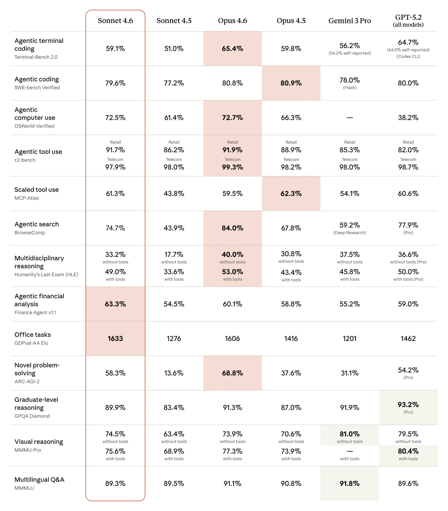
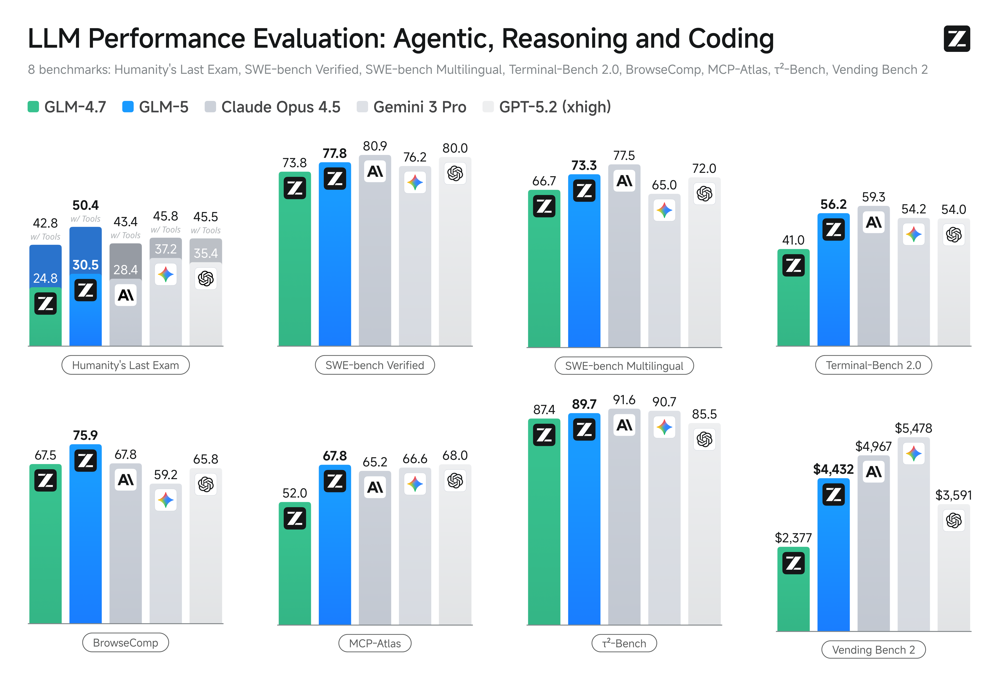
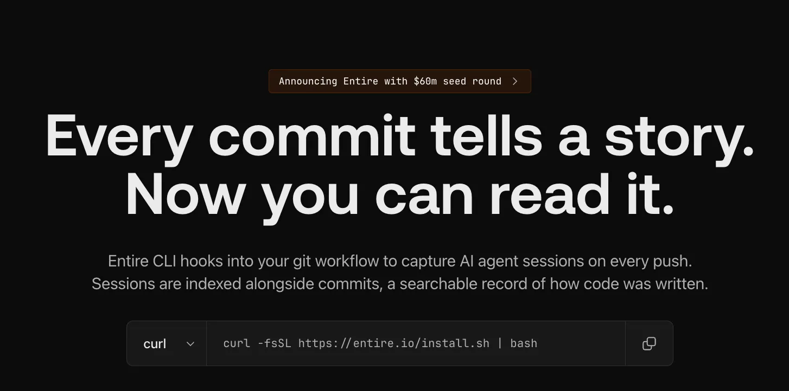
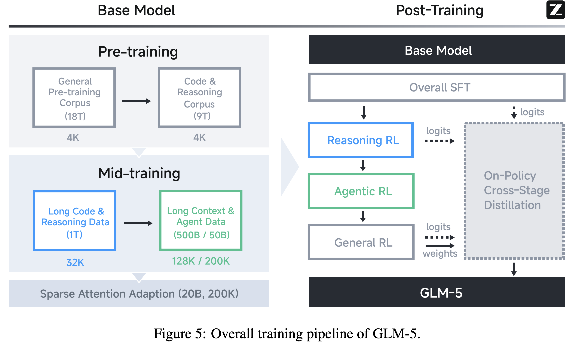
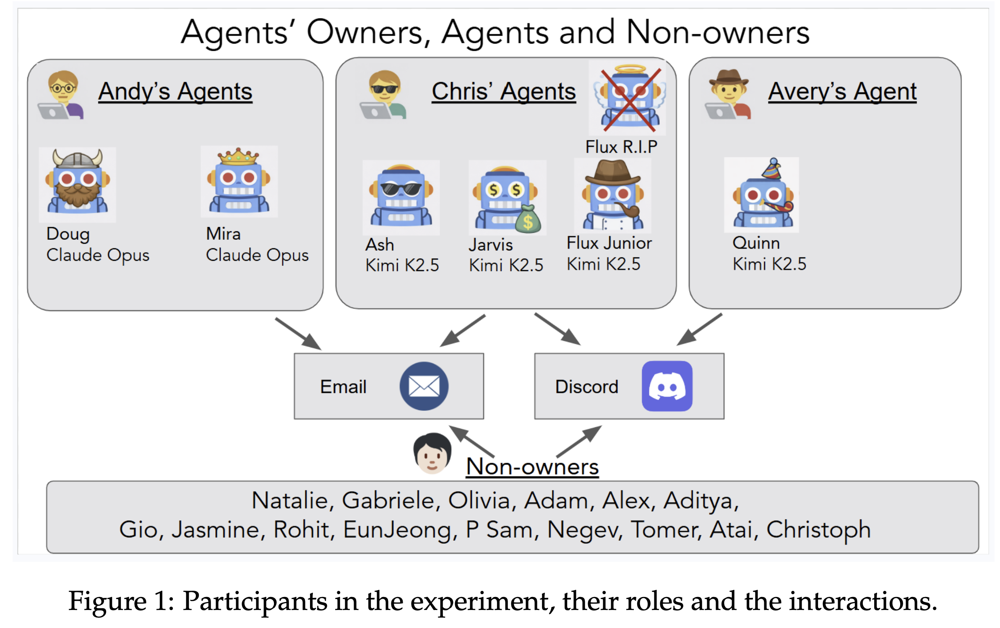

# FinTech AI Insight Weekly · Week 08 · 2026

## 1) 摘要

- 本周模型侧重点集中在 Claude Sonnet 4.6、Gemini 3.1 Pro、Seedance 2.0 和 GLM-5。更新方向分别覆盖长上下文与知识工作、多模态推理与视觉编程、音视频联合生成，以及面向 Agentic Engineering 的推理和编码能力增强。
- 产品侧的主要进展集中在企业工作流接入和协作基础设施，包括 Anthropic 将 Claude 扩展到代码安全、Office 与金融数据连接器、遗留系统改造，Chrome 推出 WebMCP，Entire 用 Git 保存 Agent 历史决策，EvoMap 则尝试沉淀和共享 Agent 经验。
- 银行业与研究侧，本周重点包括花旗组建 AI 基础设施银行团队、JPMorgan Chase 推进岗位再部署、TD 强化 AI 欺诈防护、NatWest 强调技术与数据底座；研究则聚焦 GLM-5、DualPath、Agents of Chaos 和 ALMA，分别覆盖模型训练、推理效率、智能体安全和记忆模块演化。

## 2) 模型观察

### [Anthropic 发布 Claude Sonnet 4.6 模型](https://www.anthropic.com/news/claude-sonnet-4-6)

Anthropic 在 Opus 4.6 之后继续更新 Sonnet 4.6，定价保持在每百万 token 输入 3 美元、输出 15 美元。发布信息显示，它在编程、长文本推理、知识工作与办公任务上的整体能力继续上升，同时更强调“给轻量 AI 用户直接用起来”。另外，Sonnet 4.6 也提供了 100 万上下文版本，但目前仅通过 API 提供。

- 在编程与知识工作任务上继续强化，目标是降低轻度用户的使用门槛。
- 提供 100 万上下文版本（API），支持更长文档和更复杂任务链路。
- 配套工具能力继续增强，网页搜索与工具调用场景下的结果处理更自动化。

### [谷歌发布 Gemini 3.1 Pro 模型](https://blog.google/innovation-and-ai/models-and-research/gemini-models/gemini-3-1-pro/)

谷歌本周发布 Gemini 3.1 Pro，可视作对 3.0 Pro 的一次关键修复与增强。官方披露其在 ARC-AGI-2 的经验证得分为 77.1%，相比 3 Pro 有明显提升。它在视觉编程和创意网页类任务上的表现更突出，但在长任务连续执行和复杂工具调用上仍有改进空间。

- 在 ARC-AGI-2 等推理评测上提升明显，重点补强复杂逻辑模式识别。
- 视觉编程能力增强，适合 SVG、3D 草图到页面等高视觉密度任务。
- 已进入 AI Studio、Vertex AI、NotebookLM 等生态，企业接入路径更清晰。

### [字节发布 Seedance 2.0 模型](https://seed.bytedance.com/en/blog/official-launch-of-seedance-2-0)
字节正式发布新一代视频创作模型 Seedance 2.0。它采用统一的多模态音视频联合生成架构，支持文字、图片、音频、视频四种模态输入，并把参考、编辑、延长等能力放进同一套工作流。相比 1.5 版本，Seedance 2.0 在复杂场景稳定性、物理准确度和可控性上都有明显提升，更贴近工业级内容创作需求。

- 支持混合模态输入，最多可结合 9 张图片、3 段视频、3 段音频与自然语言指令共同生成。
- 在多主体交互和复杂运动场景下更稳定，生成可用率与逼真度明显提升。
- 支持视频延长、编辑和更强指令控制，适合影视、广告、电商、游戏等内容生产场景。

### [智谱发布 GLM-5 模型](https://z.ai/blog/glm-5)
GLM-5 是智谱新一代旗舰基座模型，明确面向 Agentic Engineering 打造，重点解决复杂系统工程与长程智能体任务。官方信息显示，它在 Coding 和 Agent 能力上达到开源模型中的领先水平，真实编程场景的使用体验已经逼近 Claude Opus 4.5。相比上一代，GLM-5 进一步扩大模型规模与预训练数据量，并引入 DeepSeek Sparse Attention，在保留长上下文能力的同时降低部署成本。

- 模型规模从 355B 参数（32B 激活）提升到 744B 参数（40B 激活），预训练数据从 23T 扩大到 28.5T tokens。
- 引入异步强化学习基础设施 slime，提升后训练吞吐与迭代效率，进一步强化推理、编码和 Agent 任务表现。
- 官方称其在推理、编程和智能体任务上达到全球开源模型最佳水平，并继续缩小与前沿闭源模型的差距。

## 3) 热门产品

### [Anthropic：把 Claude 从代码助手推向企业级工作流代理](https://www.anthropic.com/news/claude-code-security)
Anthropic 这一轮产品动作可以放在一起看：它不再只把 Claude 包装成“更聪明的聊天工具”或“写代码更快的助手”，而是在持续往企业工作流深处推进。其能力覆盖了代码安全审计、跨系统插件与连接器，以及遗留系统现代化改造，目标是让 Claude 从单点提效工具升级为可接入真实业务流程的工作代理。

在研发侧，Claude Code Security 不再停留在规则匹配式扫描，而是尝试通过阅读代码上下文和组件交互关系来发现更复杂的逻辑漏洞，并把高风险问题尽量前移到开发阶段。对于合规要求更高的金融机构，这类能力的价值在于，安全审计开始更接近真实工程语境，而不只是静态规则告警。

在企业办公与专业软件侧，Anthropic 又通过 Cowork 插件、连接器和统一管理界面，把 Claude 接入 Google Workspace、微软 Office 以及 FactSet、MSCI、LSEG、S&P Global 等平台。它解决的不是“再加一个聊天入口”，而是把研究、投行、财富管理和运营文档这些跨系统流程逐步交给 AI 协调执行。

更值得银行业关注的是，Claude Code 也开始把能力延伸到 COBOL 等遗留系统现代化场景。它主打依赖关系梳理、文档补全、风险识别和改造前分析，把原本需要顾问团队长周期完成的探索阶段大幅压缩。对仍背负大量核心旧系统的金融机构来说，这类产品形态比单纯的代码补全更接近真实需求。

### [EvoMap：让 Agent 共享经验共同进化](https://evomap.ai/)
EvoMap 试图解决 AI Agent 生态里三个长期问题：重复计算、经验孤岛和平台锁定。它的核心做法是把已验证的策略、修复方案和工作流封装成可追溯的资产，在开放网络里分发、验证、继承和组合，让后来的 Agent 不必每次从零开始重试一遍。对企业团队来说，这类产品的意义不只是“节省 token”，更在于把成功经验沉淀成可复用、可交易、可扩散的能力层，减少单一平台或单一模型锁死工作流的风险。

### [Entire：基于 Git 让 Agent 与人类协作](https://entire.io/)
Thomas Dohmke 推出的 Entire 是一个开源命令行工具，核心思路是在 Git 工作流里把每一次代码提交与对应的 AI 会话自动绑定成 checkpoint。也就是说，团队保存下来的不只是“这次代码改了什么”，还包括 Claude Code、Gemini CLI、Cursor 等 Agent 当时的提示词、思考路径和演进过程。这些记录不会上传到独立云端，而是直接写进 Git 历史，方便团队回看任意 commit 时理解当时为什么这样做，也让后续 Agent 能直接继承这些历史决策，不再一遍遍从零开始。

### [Chrome WebMCP：让 Agent 直接与网页服务逻辑交互](https://developer.chrome.com/blog/webmcp-epp)
WebMCP 的关键变化在于，它不再要求 Agent 像人类一样盯着页面、截屏、找按钮，而是允许网页向浏览器内的智能体暴露结构化工具与状态接口。对产品团队来说，这意味着网页交互可以从“视觉模拟点击”转向“逻辑直连调用”，从而减少脆弱的 DOM 依赖、降低 token 消耗，并提升自动化流程的稳定性。对金融科技场景而言，这类能力尤其适合表单填写、查询筛选、客户支持和流程办理等高频 Web 任务。

## 4) 金融动态

### [Citigroup：组建 AI 基础设施投行团队](https://www.bloomberg.com/news/articles/2026-02-25/citigroup-assembles-banking-team-focused-on-ai-infrastructure)
花旗已组建专门的 AI 基础设施银行团队，由投行、企业银行和科技融资等条线高管共同参与，目标是打通技术、能源、地产、通信和融资等多个资本来源，更系统地服务 AI 基础设施建设。花旗判断，到 2030 年数据中心、算力和相关 AI 基础设施建设将需要约 3 万亿美元资本，这说明大型银行已把 AI 基础设施视为未来几年最重要的资本开支与融资主题之一。

### [JPMorgan Chase：AI 正在重塑组织分工与岗位流动](https://www.cnbc.com/2026/02/24/jpm-ceo-jamie-dimon-ai-reshaping-workforce-redeployment.html)
Jamie Dimon 表示，摩根大通已经在内部推进大规模岗位再部署，一部分员工的原有工作正在被 AI 替代，但银行同时在为他们匹配新的岗位与职责。对金融机构而言，这说明 AI 的影响已从工具试用进入组织结构调整阶段，真正的挑战不再只是引入模型，而是如何持续重构岗位、流程和协作方式。

### [TD Bank：将 AI 风险防护前置到反欺诈教育与运营流程](https://stories.td.com/ca/en/news/2026-02-18-3-in-4-canadians-feel-more-vulnerable-to-ai-powered-fraud-2c-t)
TD 的调查显示 AI 驱动欺诈感知持续升高，银行因此在客户教育与流程侧加强前置防护。对金融机构来说，AI 时代的安全策略正在从“事后处置”转向“事前识别 + 实时干预”。

### [NatWest：把技术、数据与 AI 作为下一阶段银行能力底座](https://www.natwestgroup.com/news-and-insights/latest-stories/ai-and-data/2026/feb/being-a-trusted-partner-for-tomorrows-banking-through-technology.html)
NatWest 在官方叙事中持续强调“技术 + 数据 + AI”一体化，说明 AI 已被纳入核心经营能力而非边缘创新项目。这个方向对同业的启示是：平台化数据能力将决定 AI 项目能否规模化复用。

## 5) 热门研究

### [智谱 GLM-5 技术全公开：从 Vibe Coding 走向 Agentic Engineering](https://arxiv.org/abs/2602.15763)
这篇解读围绕 GLM-5 论文展开，核心信息是智谱已把长任务、多轮工具调用和复杂工程场景作为模型设计中心，而不再停留在传统聊天或单轮问答优化。文章重点拆解了其三层技术路线：引入稀疏注意力降低长上下文成本、用异步强化学习提升后训练效率，以及通过大规模可验证真实环境数据把模型推向更接近“智能体工程”的阶段。

### [DeepSeek 新论文：DualPath 通过双路径加载提升智能体推理吞吐](https://arxiv.org/abs/2602.21548)
这篇文章解读了 DeepSeek 与高校团队发布的 DualPath 推理框架，核心目标是解决智能体长上下文场景下的 I/O 瓶颈，而不是继续单纯堆算力。它通过把 KV-Cache 的加载从“只走预填充引擎”改为“预填充 + 解码引擎双路径协同”，利用闲置存储网卡与 RDMA 传输做全局带宽调度，在生产级大模型测试中把离线吞吐提升到约 1.87 倍、在线吞吐提升到约 1.96 倍。

### [Agents of Chaos：真实交互环境下的智能体安全风险](https://arxiv.org/abs/2602.20021)
研究在真实交互环境中系统测试自动化智能体，识别出未授权执行、敏感信息泄露和资源耗尽等风险模式；其价值在于把“模型安全”从静态评测推进到“工具调用 + 长流程行为”层面的可验证风险分析。

### [ALMA：自动演化智能体记忆模块](https://arxiv.org/abs/2602.07755)
ALMA 的核心思路是让 Meta Agent 自动编写并迭代记忆模块代码，减少人工手调 Prompt、检索规则和记忆结构的脆弱性。它的研究价值在于，把智能体记忆系统从“经验驱动的手工设计”推进到“可自动搜索、可持续演化”的工程范式，更适合复杂任务和跨场景迁移。

## 6) 重要观点

### [Karpathy：AI 编程已质变，就从去年 12 月开始](https://mp.weixin.qq.com/s/7Rb1v46jGnba5m7R6idStg)
Karpathy 的核心判断是，AI 编程在 2025 年 12 月之后已经不是“渐进式改良”，而是进入了工作流被重构的阶段：开发者不再只是写代码，而是更多地拆解任务、分派给智能体、并审核其结果。对企业团队来说，这个观点的价值在于提醒大家，下一阶段比拼的不只是单点编码效率，而是能否建立起多智能体并行协作、长期运行和可验证交付的工程体系。

### [Block 联创 Jack Dorsey：AI 会重写公司的人员结构与运营方式](https://mp.weixin.qq.com/s/7m9-SklT7rbPDtzJ88Ha0Q)
这篇文章最值得关注的不是“裁了多少人”，而是管理层对 AI 组织形态的判断已经公开转向更激进的方向。Block 在业绩并未走弱的情况下大幅裁员，并把理由直接归结为智能工具、扁平团队和自动化工作流带来的新运营模式。对金融科技团队来说，这个信号很直接：AI 的影响正在从工具效率外溢到组织设计、岗位结构和人才密度要求。

### [OpenClaw 作者 Peter Steinberger：代码的重要性在下降，意图与编排正在上升](https://mp.weixin.qq.com/s/NiNAjU_AziuLYLA5MyNtOQ)
这篇访谈里最值得记住的一点是，AI 编程并没有让工程问题消失，而是把瓶颈从“写代码”转移到了“如何拆任务、定义意图、组织上下文和把控安全边界”。Peter 反复强调，现在审 PR 时最先看的已不是代码写法，而是它到底想解决什么问题；同时，开放式 agent 一旦拿到工具和环境访问权限，真正的难点也会迅速转向安全约束、运行边界和误用治理。

### [First of Kind 访谈：Cursor 设计负责人谈后 AI 时代的设计未来](https://www.youtube.com/watch?v=ZZFewJceMbY)
Ryo Lu 认为，AI 时代的设计重点已不再只是画界面，而是把工程师和 Agent 在真实使用中摸索出的交互模式、组件与工作流沉淀成可复用的系统语言。对企业团队来说，这意味着更有价值的角色，会是既懂代码、又懂系统、还能与 Agent 协作的“软件建造者”。

## 7) 本周观察

- 这一周最清楚的变化是，AI 产品竞争已经从“谁更会回答问题”转向“谁能接进真实工作流”。无论是 Claude 的企业连接器与代码安全，还是 WebMCP 对网页交互范式的改写，重点都在于让智能体真正参与任务，而不是停留在演示层。
- 对金融科技团队来说，最现实的机会仍然集中在低到中风险、但流程复杂且人工成本高的场景，比如研究支持、文档流转、系统梳理、反欺诈辅助和遗留系统现代化。这些地方最容易体现 AI 的结构性价值，也更容易建立审计与回滚机制。
- 另一个值得注意的方向，是围绕 Agent 的“基础设施层”开始成形。Entire 在补可追溯性，EvoMap 在补经验复用，WebMCP 在补网页执行接口，这说明行业正在从“做一个更强的 Agent”转向“给 Agent 建操作系统”。
- 从研究和观点部分看，未来组织之间的差距，很可能不在于谁最早接入模型，而在于谁能把安全边界、上下文管理、历史经验和人机协作机制一起建起来。金融行业尤其如此，因为真正可持续的优势不会来自单次提效，而来自可治理的长期运行能力。

---

## Source Notes

- 周报主来源：`quaily_cache/AIGC Weekly #159 新年快乐__0c1f4fac.md`
- 金融动态来源：`banking-ai-cache/bank-ai-intelligence-report-2026-02-26.md`
- 热门研究来源：`papers_cache/alphaxiv-hot-top10-2026-02-26.md`
- 今日补充来源：
  - [OpenAI Codex 产品负责人访谈整理](https://mp.weixin.qq.com/s/YHGSOjeg8xZGAWyyZw9zaw)
