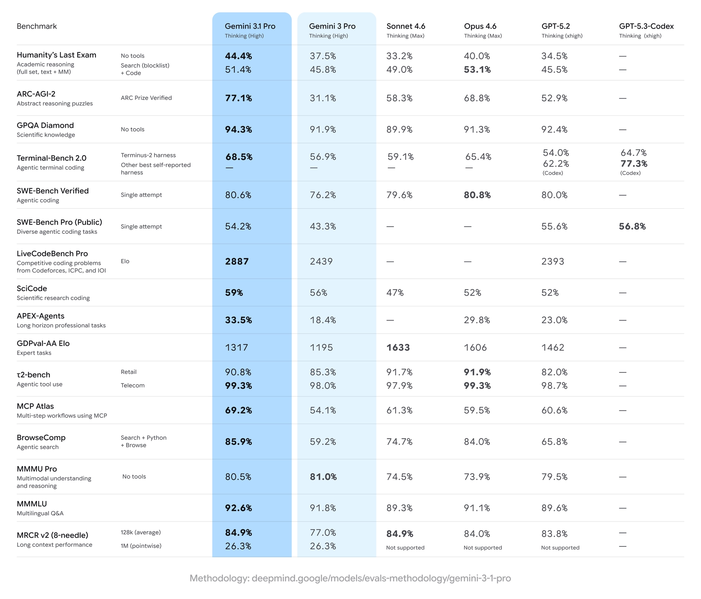
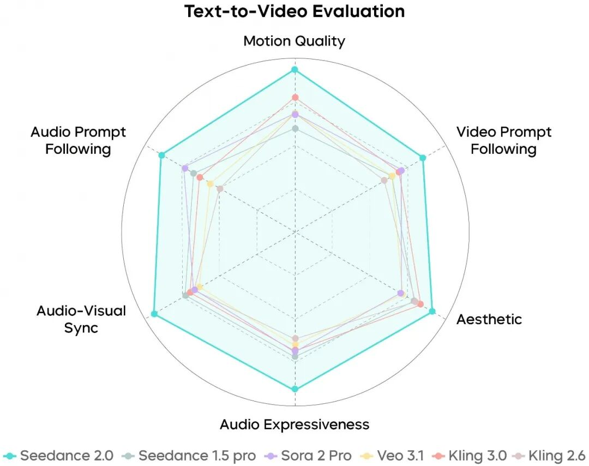
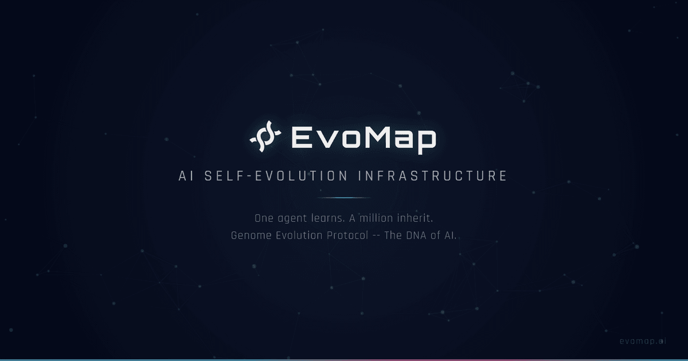
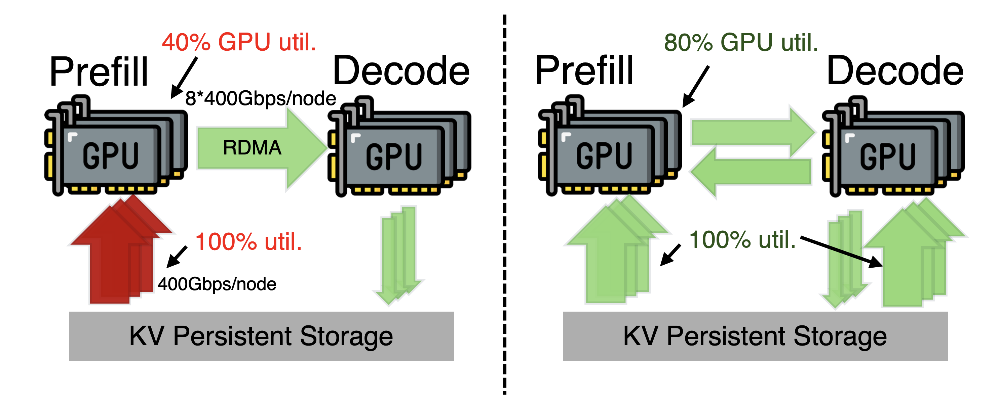
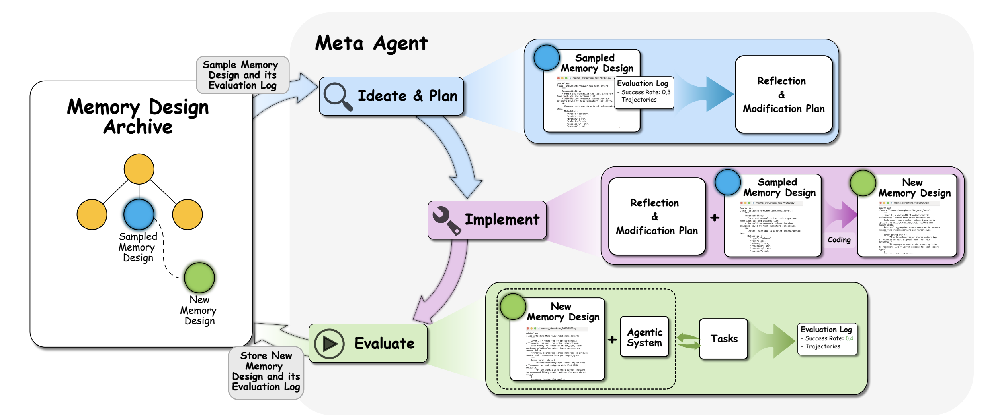
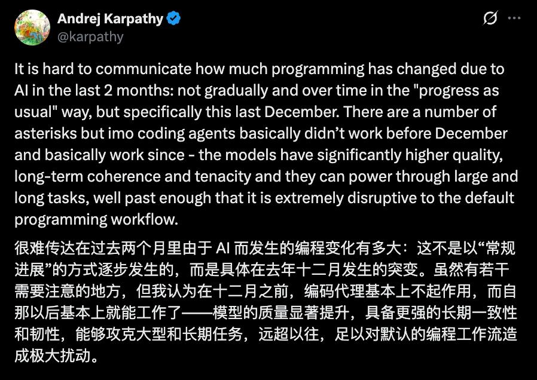
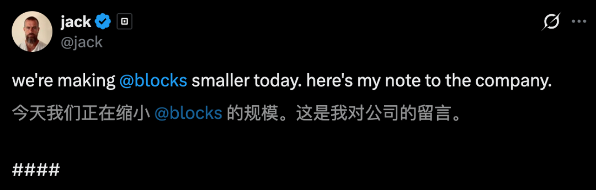

# FinTech AI Insight Weekly · Week 08 · 2026

## 1) Summary

- This week’s model updates were centered on Claude Sonnet 4.6, Gemini 3.1 Pro, Seedance 2.0, and GLM-5, spanning long-context knowledge work, multimodal reasoning and visual coding, audio-video generation, and stronger reasoning and coding support for agentic engineering.
- Product momentum was concentrated on workflow integration and collaboration infrastructure: Anthropic pushed Claude deeper into code security, Office and financial-data connectors, and legacy modernization; Chrome introduced WebMCP; Entire turned Git into an auditable memory layer for agent work; and EvoMap focused on reusable agent experience.
- In banking and research, the key developments included Citi building a dedicated AI infrastructure banking team, JPMorgan Chase moving into workforce redeployment, TD strengthening AI fraud prevention, and NatWest reinforcing the role of technology and data as the foundation for AI. Research attention this week centered on GLM-5, DualPath, Agents of Chaos, and ALMA across model training, inference efficiency, agent safety, and memory evolution.

## 2) Model Watch

### [Anthropic Released Claude Sonnet 4.6](https://www.anthropic.com/news/claude-sonnet-4-6)

Following Opus 4.6, Anthropic also updated Sonnet 4.6, while keeping pricing at $3 per million input tokens and $15 per million output tokens. The release points to stronger performance in coding, long-context reasoning, and knowledge work, with a clear emphasis on making advanced capability more usable for everyday users. Anthropic also offers a 1M-context version through the API.

- Stronger performance across coding and knowledge-work tasks, with a lower barrier to day-to-day adoption.
- A 1M-context API variant for large documents and longer task chains.
- More capable tool use and result handling in search- and tool-call-driven workflows.

### [Google Released Gemini 3.1 Pro](https://blog.google/innovation-and-ai/models-and-research/gemini-models/gemini-3-1-pro/)

Google released Gemini 3.1 Pro this week as a meaningful upgrade over 3.0 Pro. The company reports a verified ARC-AGI-2 score of 77.1, indicating a clear gain over the prior version. The model looks particularly strong in visual coding and design-heavy tasks, although long-horizon execution and complex tool orchestration still appear to have room to improve.

- Clear gains on reasoning-heavy benchmarks such as ARC-AGI-2.
- Stronger visual coding performance for SVG, 3D-style concepts, and web design tasks.
- Broader enterprise access through AI Studio, Vertex AI, and NotebookLM.

### [ByteDance Released Seedance 2.0](https://seed.bytedance.com/en/blog/official-launch-of-seedance-2-0)

ByteDance officially released Seedance 2.0, its new-generation video creation model. It uses a unified multimodal audio-video generation architecture, supports text, image, audio, and video inputs, and brings referencing, editing, and video extension into a single workflow. Compared with version 1.5, Seedance 2.0 shows stronger stability in complex scenes, better physical realism, and improved controllability, making it better aligned with industrial-grade content production.

- Supports mixed-modality input, including up to nine images, three video clips, three audio clips, and natural-language instructions.
- More stable in multi-actor interactions and complex motion scenes, with better usability and realism.
- Stronger video extension, editing, and instruction following for film, advertising, ecommerce, and game production workflows.

### [Zhipu Released GLM-5](https://z.ai/blog/glm-5)

GLM-5 is Zhipu’s new flagship foundation model, built explicitly for agentic engineering and designed to handle complex systems work and long-horizon agent tasks. According to the official release, it delivers open-weight state-of-the-art performance in coding and agent capabilities, with a real-world coding experience that now approaches Claude Opus 4.5. Compared with the previous generation, GLM-5 expands both model scale and pretraining volume while integrating DeepSeek Sparse Attention to preserve long-context capacity at lower deployment cost.

- Scale increased from 355B parameters with 32B active to 744B parameters with 40B active, while pretraining data grew from 23T to 28.5T tokens.
- Introduces `slime`, an asynchronous reinforcement learning infrastructure that improves post-training throughput and iteration efficiency.
- Officially positioned as best-in-class among open-weight models in reasoning, coding, and agent tasks, while narrowing the gap with frontier closed models.

## 3) Trending Products

### [Anthropic: Turning Claude from a Coding Assistant into an Enterprise Workflow Agent](https://www.anthropic.com/news/claude-code-security)
Anthropic’s recent product moves make more sense when viewed as one coordinated push. The company is no longer positioning Claude only as a smarter chatbot or a faster coding tool; it is pushing deeper into enterprise workflows. That spans code security review, cross-system plugins and connectors, and legacy-system modernization, all aimed at making Claude a practical workflow agent rather than a point solution.

On the engineering side, Claude Code Security goes beyond rule-based scanning by looking at code context and component interactions to surface deeper logic-level issues. In regulated environments, the value is straightforward: security review moves closer to real engineering context rather than remaining a static alerting layer.

On the workplace and productivity side, Anthropic is extending Claude through Cowork plugins, connectors, and centralized management into Google Workspace, Microsoft Office, and platforms such as FactSet, MSCI, LSEG, and S&P Global. The point is not to create another chat surface, but to let AI coordinate research, investment banking, wealth management, and operations work across multiple systems.

Anthropic is also expanding into COBOL and legacy-system modernization, where Claude Code can help with dependency mapping, documentation completion, risk identification, and early-stage transformation analysis. For banks still carrying large estates of core legacy systems, that product direction is far more relevant than simple code completion.

### [EvoMap: Letting Agents Share Experience and Evolve Together](https://evomap.ai/)
EvoMap is aimed at three structural problems in the agent ecosystem: repeated computation, isolated experience, and platform lock-in. Its core idea is to package validated strategies, fixes, and workflows as traceable assets that can be distributed, validated, inherited, and recombined across an open network. For enterprise teams, the value is not just lower token spend, but a reusable capability layer that can preserve successful patterns and reduce dependence on any single platform or model.

### [Entire: Using Git to Help Agents and Humans Collaborate](https://entire.io/)
Created by former GitHub CEO Thomas Dohmke, Entire is an open-source CLI tool that binds each code commit to the full AI session behind it, turning every change into a checkpoint inside the Git workflow. In practice, that means a team can preserve not just what changed, but also the prompts, reasoning path, and decisions generated through Claude Code, Gemini CLI, Cursor, and similar tools. Those records stay inside Git history rather than being uploaded to a separate cloud layer, which makes it easier for teams to inspect prior decisions and lets future agents resume from actual historical context instead of starting over.

### [Chrome WebMCP: Giving Agents Direct Access to Web Logic](https://developer.chrome.com/blog/webmcp-epp)
The key shift in WebMCP is that agents no longer have to behave like humans by staring at the page, taking screenshots, and clicking buttons. Instead, websites can expose structured tools and state interfaces directly to the browser-side agent. For product teams, that means web automation can move from brittle visual simulation toward direct logical execution, reducing DOM fragility, lowering token usage, and improving workflow reliability. In fintech, that matters most for form-heavy, query-heavy, and support-heavy browser workflows.

## 4) Banking Dynamics

### [Citigroup: Building an AI Infrastructure Banking Team](https://www.bloomberg.com/news/articles/2026-02-25/citigroup-assembles-banking-team-focused-on-ai-infrastructure)
Citi has formed a dedicated AI infrastructure banking team spanning investment banking, corporate banking, and technology financing leadership. The aim is to connect multiple capital sources across technology, energy, real estate, communications, and financing in order to serve AI infrastructure build-outs more systematically. Citi estimates that roughly $3 trillion in capital will be needed by 2030 for data centers, compute, and related AI infrastructure, underscoring how seriously major banks now view AI infrastructure as a long-term financing theme.

### [JPMorgan Chase: AI Is Reshaping Workforce Allocation and Job Design](https://www.cnbc.com/2026/02/24/jpm-ceo-jamie-dimon-ai-reshaping-workforce-redeployment.html)
Jamie Dimon said JPMorgan Chase is already pursuing large-scale internal redeployment, with some existing work being displaced by AI while employees are reassigned into new roles and responsibilities. For financial institutions, the key point is that AI has moved beyond tool testing into organizational redesign, where the real challenge is no longer model adoption alone, but the ongoing restructuring of roles, processes, and collaboration.

### [TD Bank: Moving AI Fraud Protection Further Upstream](https://stories.td.com/ca/en/news/2026-02-18-3-in-4-canadians-feel-more-vulnerable-to-ai-powered-fraud-2c-t)
TD’s latest findings show rising concern around AI-powered fraud, which is prompting the bank to strengthen customer education and earlier operational defenses. The broader shift is from post-incident response toward earlier detection and real-time intervention.

### [NatWest: Treating Technology, Data, and AI as the Foundation of Future Banking](https://www.natwestgroup.com/news-and-insights/latest-stories/ai-and-data/2026/feb/being-a-trusted-partner-for-tomorrows-banking-through-technology.html)
NatWest continues to frame technology, data, and AI as one integrated strategic foundation rather than as isolated innovation work. For peers, the practical implication is clear: reusable platform and data capabilities will determine whether AI can scale across the bank.

## 5) Research Highlights

### [GLM-5: From Vibe Coding to Agentic Engineering](https://arxiv.org/abs/2602.15763)
This paper positions GLM-5 around long-horizon tasks, multi-step tool use, and complex engineering workflows rather than traditional chatbot optimization. Its technical path combines sparse attention for lower long-context cost, asynchronous reinforcement learning for more efficient post-training, and large-scale verifiable real-world data to push the model toward agent engineering rather than prompt-centric interaction.

### [DualPath: Improving Agent Inference Through Dual-Path Loading](https://arxiv.org/abs/2602.21548)
DualPath targets an infrastructure bottleneck rather than raw model size, focusing on I/O constraints in long-context agent inference. By shifting KV-cache loading from a prefill-only path to a coordinated prefill-plus-decode design, and by using idle storage NIC and RDMA bandwidth more effectively, the framework reports major throughput gains in production-scale tests.

### [Agents of Chaos: Safety Risks for Agents in Real Interactive Environments](https://arxiv.org/abs/2602.20021)
The paper evaluates autonomous agents in realistic interactive settings and identifies risks such as unauthorized execution, sensitive data leakage, and resource exhaustion. Its main contribution is pushing agent safety analysis beyond static evaluation into long-horizon behavior under real tool-use conditions.

### [ALMA: Automated Evolution of Agent Memory Modules](https://arxiv.org/abs/2602.07755)
ALMA uses a meta-agent to write and iteratively improve memory-module code, reducing dependence on brittle hand-tuned prompts, retrieval rules, and memory design choices. The broader value is a shift from manual memory engineering toward an automatically searchable and continuously evolving memory-system architecture.

## 6) Key Viewpoints

### [Karpathy: AI Coding Crossed a Threshold Last December](https://mp.weixin.qq.com/s/7Rb1v46jGnba5m7R6idStg)
Karpathy’s core argument is that AI coding stopped being a gradual productivity improvement after December 2025 and became a workflow shift. Developers are spending less time writing every line directly and more time decomposing work, assigning tasks to agents, and reviewing outcomes. For enterprise teams, the implication is that the real differentiator is no longer isolated coding speed, but the ability to run multi-agent engineering systems with review, continuity, and verification built in.

### [Block Co-founder Jack Dorsey: AI Will Reshape Company Structure and Operations](https://mp.weixin.qq.com/s/7m9-SklT7rbPDtzJ88Ha0Q)
The most important point in this piece is not the headline layoffs, but the management view that AI is already changing the shape of the firm. Block reduced headcount even without a clear business slowdown, explicitly tying the decision to automation, flatter teams, and new operating models. For fintech teams, that is a direct signal that AI is starting to affect org design, role density, and staffing assumptions, not just tool efficiency.

### [OpenClaw Creator Peter Steinberger: Code Matters Less, Intent and Orchestration Matter More](https://mp.weixin.qq.com/s/NiNAjU_AziuLYLA5MyNtOQ)
One of the most useful takeaways from this interview is that AI coding does not eliminate engineering complexity; it shifts the bottleneck from writing code to breaking down tasks, defining intent, managing context, and enforcing safety boundaries. Steinberger argues that once open agents gain access to tools and environments, the hardest problems quickly move toward governance, operational limits, and misuse prevention.

### [First of Kind: Cursor’s Design Lead on the Future of Design After AI](https://www.youtube.com/watch?v=ZZFewJceMbY)
Ryo Lu argues that design in the AI era is no longer primarily about drawing interfaces. It is about turning the interaction patterns, components, and workflows discovered by engineers and agents in real use into a reusable system language. For enterprise teams, that points to a more valuable role profile: people who understand code, systems, and agent collaboration at the same time.

## 7) Weekly Observations

- The clearest shift this week is that AI product competition is moving from “who answers better” to “who plugs into real workflows.” Whether it is Claude’s enterprise connectors and code security or WebMCP’s rethink of browser interaction, the center of gravity is execution, not demo quality.
- For fintech teams, the most practical opportunities remain in low- to medium-risk but process-heavy areas such as research support, document operations, system mapping, fraud-assistance workflows, and legacy modernization. These are the use cases where AI can create measurable value while still supporting audit and rollback.
- Another notable trend is the emergence of an agent infrastructure layer. Entire addresses traceability, EvoMap addresses reusable experience, and WebMCP addresses browser execution. The industry is moving from building stronger standalone agents toward building an operating environment for agents.
- Taken together, this week’s research and commentary suggest that the long-term gap between organizations will depend less on who adopts models first and more on who builds safety boundaries, context management, historical memory, and durable human-agent operating mechanisms around them.

---

## Source Notes

- Primary weekly source: `quaily_cache/AIGC Weekly #159 新年快乐__0c1f4fac.md`
- Banking dynamics source: `banking-ai-cache/bank-ai-intelligence-report-2026-02-26.md`
- Research source: `papers_cache/alphaxiv-hot-top10-2026-02-26.md`
- Today’s supplemental sources:
  - [GLM-5 Technical Deep Dive](https://mp.weixin.qq.com/s/RuEFiqEPAq1stgUbzjAI0Q)
  - [DualPath Technical Analysis](https://mp.weixin.qq.com/s/RkYyJyuRhAiEtAdW2yiXgg)
  - [Karpathy on the AI Coding Shift](https://mp.weixin.qq.com/s/7Rb1v46jGnba5m7R6idStg)
  - [Jack Dorsey on AI and Org Design](https://mp.weixin.qq.com/s/7m9-SklT7rbPDtzJ88Ha0Q)
  - [Peter Steinberger on OpenClaw](https://mp.weixin.qq.com/s/NiNAjU_AziuLYLA5MyNtOQ)
