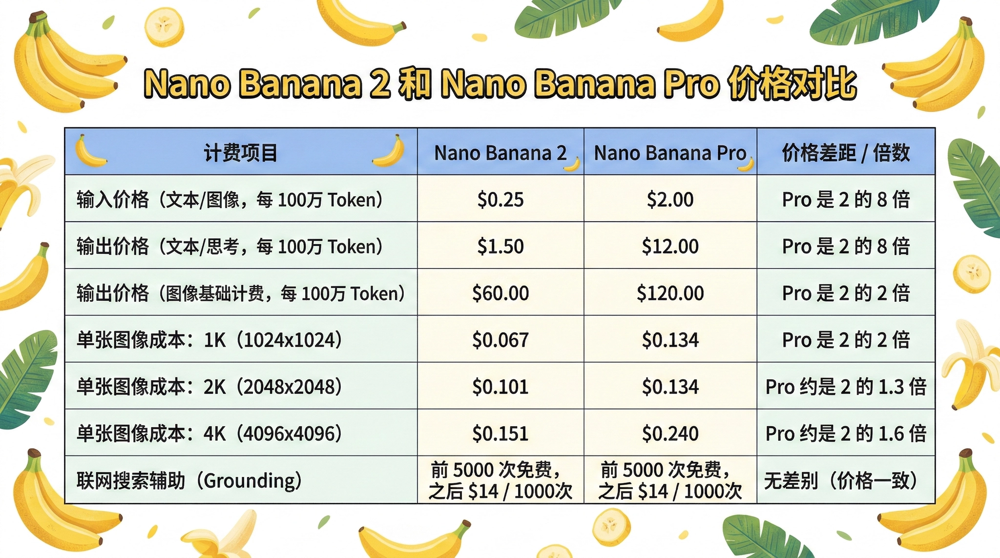
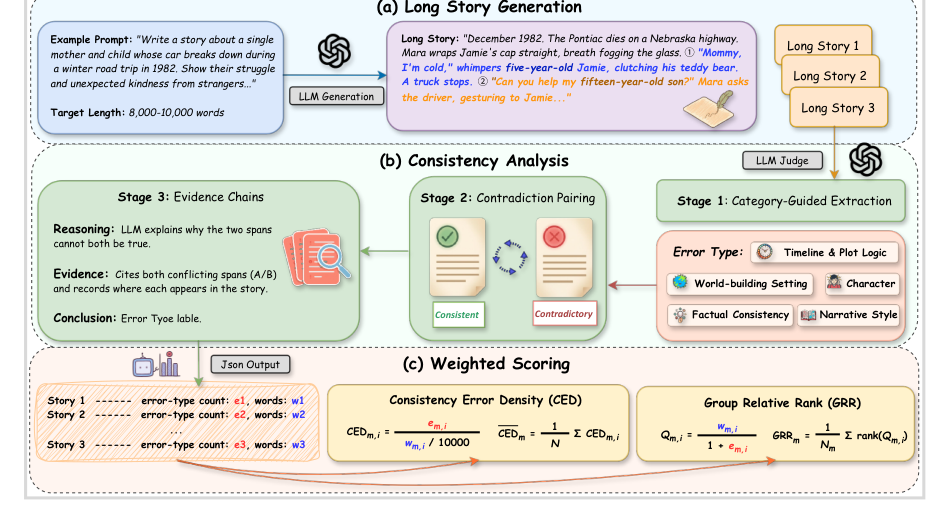
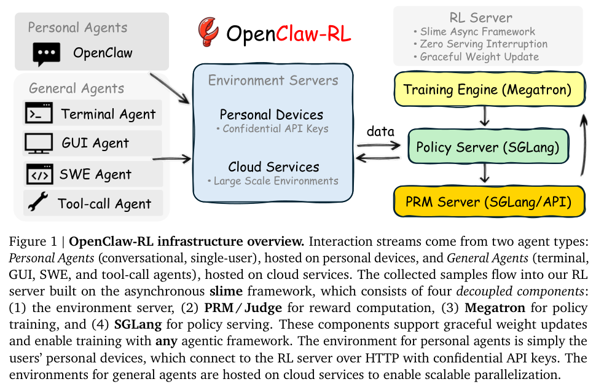
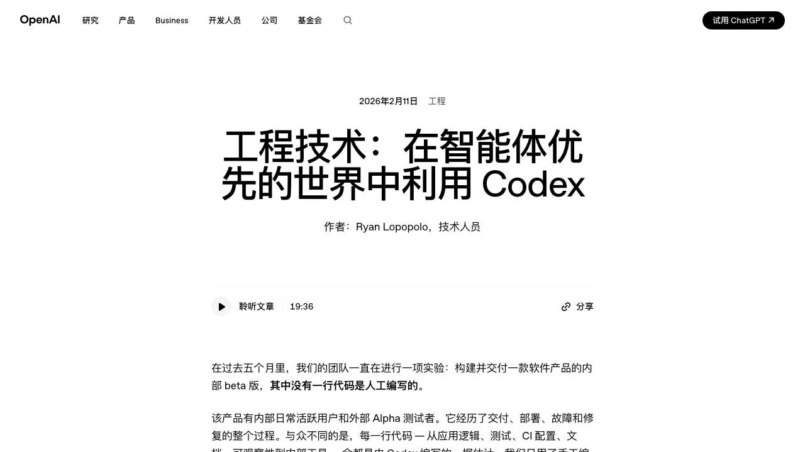

# FinTech AI Insight Weekly · Week 09 · 2026

## 1) 摘要

- 本周的变化主要集中在 AI 的执行能力与系统接口上。模型侧出现了更强调长上下文、高频调用和时延表现的更新，产品侧则继续向支付、企业协作、自动化测试和长期在岗的数字员工延伸。
- 从金融机构相关动态看，agent 已开始进入更接近真实业务的链路。Santander 和 Westpac 分别推进到支付执行场景，Capital One 继续把 AI 用在呼叫中心效率提升，Nordea 则把 AI adoption 放到组织层面讨论。
- 产品信号也比较一致：一类产品在补交易与权限基础设施，一类产品在把 Workspace、测试体系和内部协作系统整理成更适合 agent 调用的操作界面。
- 研究与工程讨论的重心则更偏向长期任务、低成本试验、agent-first 的 CLI 与软件工程组织方式，关注点从单点能力转向如何让系统持续运行、验证和演进。

## 2) 模型观察

### [OpenAI 发布 GPT-5.4 与 GPT-5.3 Instant](https://openai.com/zh-Hans-CN/index/introducing-gpt-5-4/)

OpenAI 本周发布 GPT-5.4，并同步推出 GPT-5.3 Instant。GPT-5.4 更像是把代码、推理和通用任务重新放回同一条主模型线上，在 Codex 应用和 API 中提供最高 100 万上下文能力，并继续强化 tool search、tool calling 与长任务处理；GPT-5.3 Instant 则重点放在更低时延、更直接的响应方式以及更好的联网搜索整合。

- GPT-5.4：统一代码、推理和通用任务能力。
- GPT-5.4：在 Codex 应用和 API 中提供最高 100 万上下文。
- GPT-5.4：继续强化工具调用和长流程任务表现。
- GPT-5.3 Instant：面向低时延、高频交互场景。
- GPT-5.3 Instant：重点优化拒答逻辑与搜索整合。

### [谷歌发布 Nano Banana 2 图像生成模型](https://blog.google/innovation-and-ai/technology/ai/nano-banana-2/)

谷歌发布基于 Gemini 3.1 Flash 的 Nano Banana 2。它的变化主要体现在速度提升、文字渲染与图表清晰度增强，以及对超宽画幅的支持；与此同时，图像本身的纹理和美学细节有所回落。产品层面，它开始进入 Gemini、搜索 AI Mode 与 Lens、AI Studio、Gemini API、Vertex AI、Flow 和 Google Ads。

- 生成速度更快。
- 文字与图表渲染更清晰。
- 支持超宽图片生成。
- 已进入 Gemini、AI Studio、Vertex AI、搜索 AI Mode、Lens、Flow 和 Google Ads。

### [智谱推出 GLM-5-Turbo](https://mp.weixin.qq.com/s/be2YN5Zi49BLRPJLEJm9uw?scene=1)

智谱推出 GLM-5-Turbo。它是 GLM-5 的高速变体，重点不是追求最重的单次推理，而是更适合 OpenClaw 这类以 agent 为主的高频调用环境。

- GLM-5-Turbo：GLM-5 的高速变体。
- 更适合以 agent 为主的高频运行环境。
- 更值得关注的点是吞吐、时延与调用效率。

## 3) 热门产品

### [Ramp：给 Agent 用的信用卡](https://agents.ramp.com/cards)

Ramp 的 Agent Card 是一张面向 AI agent 的可编程企业信用卡。企业先在 Ramp 开通并获批账户，然后可以为不同 agent 单独签发带有额度、商户分类限制和审批策略的虚拟卡；agent 再通过 Ramp 的 API 或 CLI 创建卡片、发起支付并自动报销，而所有交易都会像员工消费一样进入 Ramp 后台，保留审计记录、发票收据和分类信息。

- 可以为不同 agent 分配独立卡片、额度和商户限制。
- 支持通过 API / CLI 创建卡片、发起支付与报销。
- 订阅、采购和供应商付款都可以纳入同一套审批与风控流程。
- 重点在于把交易权限变成可编排、可审计、可回收的企业能力。

### [gws：谷歌 Workspace 的 CLI 工具](https://github.com/googleworkspace/cli)

gws 是一个把 Google Workspace 全部 API 重新组织成命令行工具的项目。它在运行时读取 Google Discovery Service，动态生成 Drive、Gmail、Calendar、Docs、Sheets、Chat、Admin 等 Workspace API 的子命令与参数，并统一输出结构化 JSON，既能替代手写 curl，也更适合 LLM 和 agent 调用。

- 用 Rust 实现，并同时提供 npm 包与预编译二进制。
- 支持 `gws auth setup`、`gws auth login` 和环境变量等多种 OAuth 流程。
- 内置 100+ 个 Agent Skill，并给出与 Gemini CLI、OpenClaw 和 Model Armor 的结合方式。
- 重点不在“把 API 搬进终端”，而在把企业协作系统暴露成稳定、可枚举的 agent 调用面。

### [TestSprite：AI 自动化测试平台](https://www.testsprite.com/)

TestSprite 是一个面向 Web、移动端和 API 的 AI 自动化测试平台。它通过 AI 代理理解产品功能，生成并维护端到端测试用例，同时支持无代码录制、自然语言编写测试、视觉回归检测、多浏览器与多版本兼容性测试，以及本地环境接入。

- 用 AI 代理生成和维护回归测试用例。
- 同时覆盖 Web、iOS、Android、WebView 和 API。
- 支持无代码录制、自然语言测试和视觉回归。
- 重点在于降低手工回归和维护脚本的成本。

### [Junior：AI 员工，有自己的邮箱、Notion、github 等](https://junior.so/)

Junior 把 agent 设计成有独立身份的“数字员工”。你可以给它单独的邮箱、Slack 身份和名字，再接上 Slack、Gmail、Notion、GitHub、HubSpot 等真实工作工具；它会在短时间内读完公司文档、Slack 历史、会议记录和代码，形成“组织记忆”，然后持续监控业务、发邮件、写文档、开 JIRA 工单、跟进任务、做会议纪要并提取 action items。

- 让 agent 以独立身份进入真实工作系统。
- 强调跨文档、会议、代码和聊天记录的长期上下文积累。
- 不只是执行单次任务，而是持续跟进业务和协作事项。
- 重点在于把“数字员工”落到长期在岗和跨系统记忆上。

## 4) 金融动态

### [Santander：完成欧洲首个由 AI agent 端到端执行的真实支付](https://www.santander.com/en/press-room/press-releases/2026/03/santander-and-mastercard-complete-europes-first-live-end-to-end-payment-executed-by-an-ai-agent)

Santander 与 Mastercard 完成了欧洲首个由 AI agent 端到端执行的真实支付案例，这比“聊天式支付”更进一步，因为它已经触碰到交易执行链路。对金融科技行业来说，这条消息的意义非常直接：agent commerce 开始从概念验证走向真实支付基础设施的连接与试运行。

### [Capital One：把 AI 直接用到呼叫中心效率提升](https://www.autofinancenews.net/allposts/technology/capital-one-boosts-call-center-results-with-ai/)

Capital One 这条动态更接近多数银行短期内可复制的路径：不是一步跨进核心交易系统，而是先把 AI 用到呼叫中心与服务运营。它说明银行业的一个现实趋势是，AI 价值正在优先通过高频、可量化、容易做 ROI 评估的场景落地。

### [Westpac：与 Mastercard 完成新西兰首个受认证的 agentic transaction](https://www.mastercard.com/news/ap/en/newsroom/press-releases/en/2026/mastercard-completes-new-zealand-s-first-authenticated-agentic-transactions-with-westpac-bringing-trust-transparency-and-security-to-ai-powered-commerce/)

Westpac 与 Mastercard 的合作和 Santander 一起说明，agent 支付并不是孤立试验，而是开始在不同市场被验证。对于支付和零售金融团队，这类案例的价值在于它们正在逼近真实的身份认证、执行确认和交易可信度问题。

## 5) 热门研究

### [Agentic Memory：为大型语言模型智能体学习统一的长期与短期记忆管理](https://arxiv.org/abs/2601.01885)

大型语言模型（LLM）代理在长时程推理上面临根本性限制，因其上下文窗口有限，因此有效的记忆管理至关重要。现有方法通常将长期记忆（LTM）和短期记忆（STM）作为独立组件处理，依赖启发式或辅助控制器，这限制了适应性和端到端优化。本文提出了 Agentic Memory（AgeMem），一个将 LTM 与 STM 管理直接整合到代理策略中的统一框架。AgeMem 将记忆操作作为基于工具的动作暴露出来，使 LLM 代理能够自主决定何时以及存储、检索、更新、总结或丢弃信息。为训练这种统一行为，我们提出了三阶段渐进强化学习策略，并设计了逐步 GRPO 以应对由记忆操作引起的稀疏且不连续的奖励。五个长时程基准实验表明，AgeMem 在多种 LLM 骨干模型上持续优于强大的记忆增强基线，取得了更好的任务表现、更高质量的长期记忆以及更高效的上下文使用。

### [迷失于故事：LLMs 在长篇故事生成中的一致性错误](https://arxiv.org/abs/2603.05890)

当讲故事者忘记了自己的故事，会发生什么？大型语言模型（LLMs）现在可以生成长达数万字的叙事，但它们经常无法保持前后一致。在生成长篇叙事时，这些模型可能会与自己先前确立的事实、角色特征和世界规则发生矛盾。现有的故事生成基准主要关注情节质量和流畅性，导致一致性错误在很大程度上未被探索。为了解决这一空白，研究者提出了 ConStory-Bench，一个旨在评估长篇故事生成中叙事一致性的基准。该基准包含跨四种任务场景的 2000 个提示，并定义了由 5 个错误类别和 19 个细化子类型组成的分类法。研究还开发了 ConStory-Checker，一套自动化流程，用于检测矛盾并将每个判定基于明确的文本证据。通过五个研究问题评估一系列 LLMs，作者发现一致性错误呈现出明显的倾向性：它们在事实和时间维度最为常见，倾向于出现在叙事的中段，出现在具有较高词元级熵的文本片段中，并且某些错误类型倾向于共现。这些发现可以为未来改进长篇叙事生成的一致性提供参考。

### [Autoresearch：Karpathy 推出的 AI 自助科研框架](https://github.com/karpathy/autoresearch)

Autoresearch 展示的是一种更接近 agent 科研工作流的组织方式。它给 AI 代理一套精简但真实的 LLM 训练代码，让代理只修改 `train.py` 这一份模型与训练循环文件，在固定 5 分钟训练预算内反复试验、比较 `val_bpb` 指标并保留更优改动，而研究者主要通过编辑 `program.md` 设定角色与目标。整个项目强调单 GPU、自包含和统一时间预算，使同一台机器上的不同架构与超参组合可以被自动批量搜索。

### [OpenClaw-RL：仅需对话即可训练任何智能体](https://arxiv.org/abs/2603.10165)

OpenClaw-RL 关注的是如何把 agent 在真实交互过程中不断产生的“下一个状态信号”直接变成训练资源。论文的核心判断是，无论是个人对话、终端执行、GUI 交互、软件工程任务还是工具调用，动作之后出现的用户回复、工具输出、界面变化和环境状态，本质上都可以作为统一的在线学习信号来使用，而不必只依赖稀疏的标量奖励。它一方面从这些后续状态中提取评估信号，用于判断动作好坏；另一方面也提取指示性信号，用于告诉策略下一步应该如何调整。对 agent 研究来说，这种思路的重要性在于，它把“训练”从离线数据集和专门构造的 RL 环境，进一步推进到日常使用过程本身。

## 6) 重要观点

### [你需要为 AI 智能体重写你的 CLI](https://justin.poehnelt.com/posts/rewrite-your-cli-for-ai-agents/)

这篇文章最值得记住的判断是：传统“面向人类”的 CLI 不能直接拿来给 agent 用，必须重写成“面向代理”的执行界面。它的核心不是多加几个命令，而是把 CLI 变成一个可自描述、可约束、可防御的安全中间层：输入侧优先接受完整 JSON 负载而不是零碎 flags，运行时通过 schema/describe 提供机器可读的“活文档”，输出侧用字段过滤、NDJSON 和分页严格控制上下文体积，安全侧把代理视为不可信调用方，对路径、资源 ID、控制字符和双重编码做输入硬化，并把“必须 dry-run”“需要人工确认”“务必限制 fields”这类隐性经验写进 SKILL/CONTEXT 文件。更重要的是，它给出了一条很实际的改造路径：先补机器可读输出和严格校验，再补 introspection、字段掩码、dry-run 与上下文文件，最后再向 MCP、Gemini 扩展和无头鉴权这些多界面协议层暴露，让 CLI 从“人类的命令行”升级为“代理操作外部系统的安全接口”。

### [关于 AI 编程禅意的十几条原则](https://nonstructured.com/zen-of-ai-coding/)

《AI 编程之禅》这组观点最有价值的地方，在于它没有把“软件开发正在死亡”理解成工程师不再重要，而是把重点从“手工写代码”转移到“如何定义问题、组织上下文、设定约束并设计可靠反馈系统”。当代码和重构的边际成本快速下降，技术债、依赖升级和跨栈迁移都不再能用“太贵”当借口，Bug 也会在更多模型参与下变浅，但前提是测试、CI、日志、监控这些反馈回路必须先被设计好，否则生成速度越快，只会把混乱放大得更快。文章进一步强调，真正的瓶颈越来越不是 token，而是人的认知与协调能力；栈执念会下降，因为代理可以跨技术栈工作，而“买还是自建”的计算方式也会变化，许多过去必须买 SaaS 的能力开始可以由代理和基础设施自行拼装。最终，这会把软件团队的角色往前推一层：不是当更快的代码生产者，而是把代理视作一等用户，去设计对代理友好的接口、结构化上下文、权限隔离、监控、回滚和优雅降级机制，只做真正会被使用、能创造价值的系统。

### [工程技术：在智能体优先的世界中利用 Codex](https://openai.com/zh-Hans-CN/index/harness-engineering/)

这条实践最值得记住的，不是“五个月做出百万行代码”这个数字本身，而是 OpenAI 团队如何把 Codex 放进一个真正的 agent-first 工程体系里：人类尽量不写代码，而是负责设计环境、架构边界、反馈回路和仓库内的不变量，让智能体通过标准开发工具自己去生成、测试、部署、回归和维护代码。这里的关键做法，是把代码仓库视为唯一现实世界，用结构化 `docs/` 和简短 `AGENTS.md` 充当知识地图，用自定义 lint、严格分层和少量但明确的“黄金原则”约束架构与品味，再让 agent 在这个高约束环境里自动完成 UI 验证、可观测性检查、PR 循环、bug 复现、视频录制、修复和验证。它说明在吞吐量极高的智能体开发模式下，真正重要的已经不是工程师亲手写了多少代码，而是能否持续清理熵、做“垃圾回收”式重构、整理文档，并把系统设计成即使 agent 大规模参与也仍然可维护、可验证、可长期演进。

## 7) 本周观察

- 这一周的内容比较集中地指向同一个方向：AI 正在从单点能力展示，转向更具体的执行接口和操作环境。模型更新强调长上下文、时延和高频调用，产品更新则更多围绕支付、协作系统、测试和长期在岗的 agent 展开。
- 银行业相关动态也呈现出两条并行路径。一条是 Santander、Westpac 这类更接近交易执行链路的尝试，另一条是 Capital One、Nordea 这类先从呼叫中心效率和组织 adoption 切入的落地方式。
- 产品层面的共同点，是越来越多能力开始围绕企业现有系统重新组织，而不是停留在独立聊天入口。无论是支付卡、Workspace CLI、自动化测试平台还是数字员工，本质上都在解决 agent 如何稳定进入真实业务流程的问题。
- 研究与工程讨论则更多转向长期记忆、长期任务、在线训练、低成本试验以及 agent-first 的工程组织方式。对应到高合规行业，下一阶段更值得关注的，不只是模型能力上限，而是系统如何被约束、验证、持续运行并纳入治理。

---
