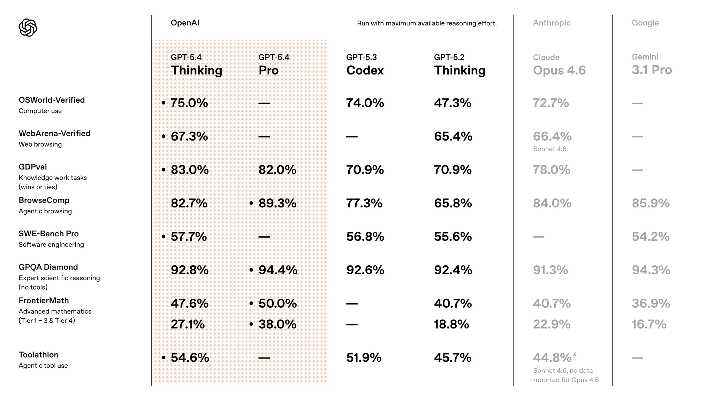
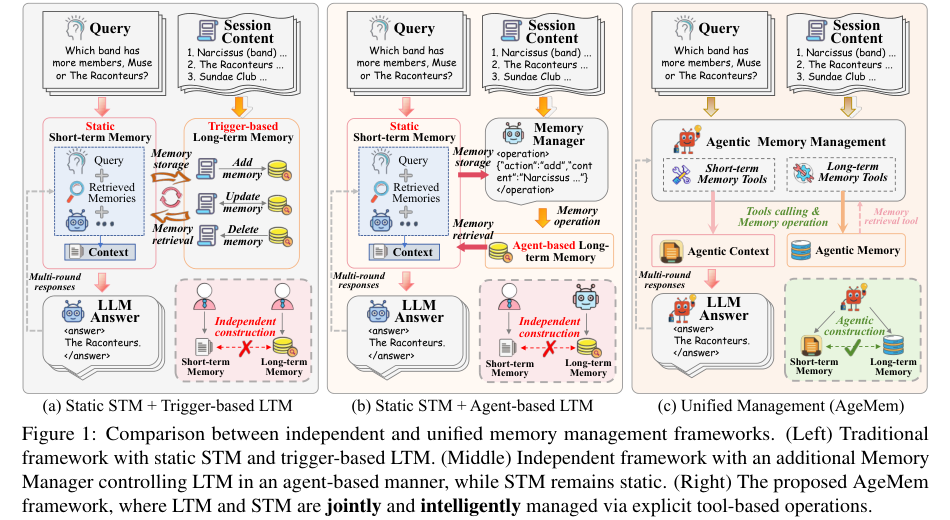
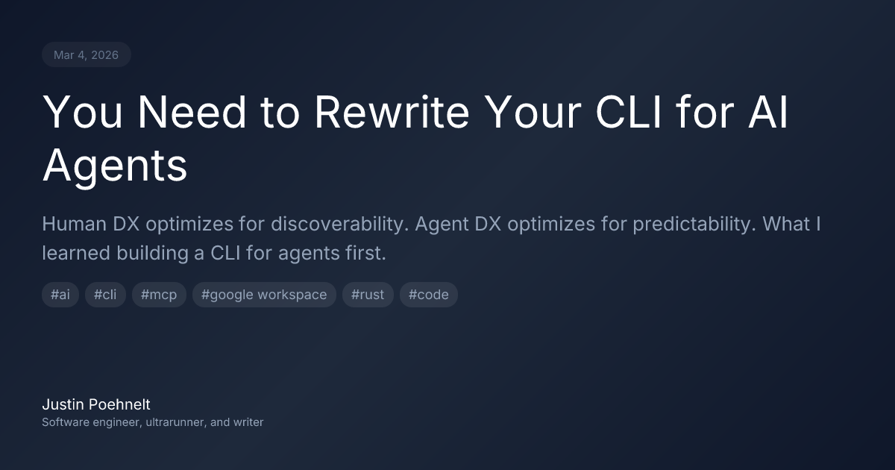

# FinTech AI Insight Weekly · Week 09 · 2026

## 1) Summary

- This week’s signal was less about isolated model rankings and more about execution. Models are being optimized for long context, latency, and repeated tool use, while products are expanding into payments, enterprise collaboration, testing, and long-running digital workers.
- In financial services, agents are moving closer to production workflows. Santander and Westpac pushed further into payment execution, while Capital One continued using AI in service operations.
- Research and engineering discussion is also shifting from one-off capability gains toward memory, long-horizon tasks, online training, and agent-first engineering systems.

## 2) Model Watch

### [OpenAI Launches GPT-5.4 and GPT-5.3 Instant](https://openai.com/index/introducing-gpt-5-4/)

OpenAI released GPT-5.4 alongside GPT-5.3 Instant. GPT-5.4 is the more complete model line, combining coding, reasoning, and general-purpose tasks with up to one million tokens of context in the Codex app and API. GPT-5.3 Instant is the faster counterpart, aimed at lower-latency interaction and stronger search integration.

### [Google Releases Nano Banana 2](https://blog.google/innovation-and-ai/technology/ai/nano-banana-2/)

Google released Nano Banana 2, built on Gemini 3.1 Flash. The upgrade centers on faster generation, better text and chart rendering, and support for ultra-wide formats, although image texture and aesthetic detail appear somewhat weaker. It is also being rolled out across Gemini, Search AI Mode and Lens, AI Studio, the Gemini API, Vertex AI, Flow, and Google Ads.

### [Zhipu Launches GLM-5-Turbo](https://mp.weixin.qq.com/s/be2YN5Zi49BLRPJLEJm9uw?scene=1)

Zhipu launched GLM-5-Turbo, a higher-speed variant of GLM-5. The emphasis is less on the heaviest single-pass reasoning and more on agent-heavy environments such as OpenClaw, where throughput and latency matter more.

## 3) Featured Products

### [Ramp: A Credit Card for Agents](https://agents.ramp.com/cards)

Ramp’s Agent Card is a programmable corporate credit card designed for AI agents. Companies can issue separate virtual cards to different agents, each with its own limits, merchant restrictions, and approval rules, and manage payments and reimbursement through the Ramp API or CLI. Every transaction still flows into Ramp’s backend with the same auditability as employee spend.

### [gws: A Google Workspace CLI Tool](https://github.com/googleworkspace/cli)

gws reorganizes the full Google Workspace API surface into a command-line interface. It reads Google Discovery Service at runtime, generates subcommands dynamically, and standardizes output as structured JSON, making it easier to use both for developers and for agents.

### [TestSprite: An AI Test Automation Platform](https://www.testsprite.com/)

TestSprite is an AI test automation platform for web, mobile, and API scenarios. It uses AI agents to generate and maintain end-to-end test cases, while supporting no-code recording, natural-language test authoring, visual regression, compatibility testing, and local environment access.

### [Junior: An AI Employee with Its Own Email, Notion, GitHub, and More](https://junior.so/)

Junior frames the agent as a digital employee with its own identity. It can connect to tools such as Slack, Gmail, Notion, GitHub, and HubSpot, absorb company context, and then continue to monitor operations, write documents, send emails, open tickets, and follow up on work.

## 4) Financial Developments

### [Santander: Europe’s First Real End-to-End Payment Executed by an AI Agent](https://www.santander.com/en/press-room/press-releases/2026/03/santander-and-mastercard-complete-europes-first-live-end-to-end-payment-executed-by-an-ai-agent)

Santander and Mastercard completed Europe’s first real end-to-end payment executed by an AI agent. The significance is simple: agentic commerce is moving closer to live payment infrastructure and real execution.

### [Capital One: Using AI Directly to Improve Call Center Efficiency](https://www.autofinancenews.net/allposts/technology/capital-one-boosts-call-center-results-with-ai/)

The Capital One case is closer to the path many banks can replicate in the near term. Rather than moving directly into core transaction systems, it applies AI to call center and service operations, where ROI is easier to measure.

### [Westpac: New Zealand’s First Authenticated Agentic Transaction with Mastercard](https://www.mastercard.com/news/ap/en/newsroom/press-releases/en/2026/mastercard-completes-new-zealand-s-first-authenticated-agentic-transactions-with-westpac-bringing-trust-transparency-and-security-to-ai-powered-commerce/)

Together with Santander, the Westpac and Mastercard case suggests that agentic payments are no longer isolated experiments. They are starting to be tested across markets, closer to real questions of authentication, approval, and transaction trust.

## 5) Featured Research

### [Agentic Memory: Learning Unified Long-Term and Short-Term Memory Management for Large Language Model Agents](https://arxiv.org/abs/2601.01885)

Agentic Memory (AgeMem) proposes a unified way to manage long-term and short-term memory inside the agent policy itself, rather than treating them as separate modules. Memory operations are exposed as tool actions, allowing the agent to decide what to store, retrieve, update, summarize, or discard. Across five long-horizon benchmarks, the framework outperforms strong memory-augmented baselines and improves both memory quality and context efficiency.

### [Lost in Stories: Consistency Bugs in Long Story Generation by LLMs](https://arxiv.org/abs/2603.05890)

This paper focuses on consistency failures in long-form story generation. It introduces ConStory-Bench, a benchmark with 2,000 prompts across four scenarios, and ConStory-Checker, an automated pipeline for detecting contradictions with explicit textual evidence. The main finding is that consistency errors cluster around factual and temporal details, often emerge in the middle of narratives, and show recognizable co-occurrence patterns.

### [Autoresearch: Karpathy’s AI Self-Research Framework](https://github.com/karpathy/autoresearch)

Autoresearch is a compact framework for agent-driven research iteration. The agent is limited to editing `train.py`, runs repeated experiments inside a fixed five-minute budget, and keeps better results based on `val_bpb`, while the researcher mainly defines goals in `program.md`. The setup is deliberately single-GPU, self-contained, and easy to reproduce.

### [OpenClaw-RL: Train Any Agent Simply by Talking](https://arxiv.org/abs/2603.10165)

OpenClaw-RL treats the next-state signal generated by real agent interaction as training data. User replies, tool outputs, UI changes, and environment transitions are all used as online learning signals, not just sparse rewards. The core idea is to move agent training closer to everyday usage rather than relying only on offline datasets or specially constructed RL environments.

## 6) Important Viewpoints

### [You Need to Rewrite Your CLI for AI Agents](https://justin.poehnelt.com/posts/rewrite-your-cli-for-ai-agents/)

The core argument is that a human-oriented CLI cannot simply be reused for agents. It has to become an agent-oriented execution layer: machine-readable on input and output, self-describing at runtime, and hardened as if the caller were untrusted. The practical migration path is to add machine-readable output and strict validation first, then introspection, field filtering, dry-run, and finally protocol layers such as MCP.

### [Principles from The Zen of AI Coding](https://nonstructured.com/zen-of-ai-coding/)

The central claim in *The Zen of AI Coding* is that cheaper code does not make engineering irrelevant; it makes problem definition, context design, constraints, and feedback loops more important. As coding and refactoring costs fall, technical debt becomes harder to excuse, but speed only helps if testing, CI, logging, and monitoring are already in place. The deeper shift is that engineers move from writing more code to designing better systems for agents to operate inside.

### [Engineering: Harnessing Codex in an Agent-First World](https://openai.com/index/harness-engineering/)

The main takeaway from this write-up is not the headline number of “a million lines of code in five months,” but the engineering model behind it. Humans focus on the environment, architecture, constraints, and feedback loops, while agents generate, test, and maintain code through standard tools. The repository becomes the operating environment, and maintainability depends on whether documentation, linting, structure, and cleanup are strong enough to keep agent-driven output under control.

## 7) Weekly Observations

- This week points in a clear direction: AI is moving from isolated capability demos toward concrete execution interfaces and operating environments.
- In banking, one path is closer to transaction execution, as seen in Santander and Westpac; the other starts with operational efficiency, as seen in Capital One.
- Across products, research, and engineering, the common question is no longer just what models can do, but how agents can be integrated into real systems in a stable, governed, and verifiable way.

---
